# RAG 知识库高级架构流程与优化方案

> 基于 `06_rag_advanced/` 源码分析 + 生产级优化方向综合编写

---

## 零、架构审查结论

结论：**这套架构总体可行，可以作为中小型到中大型 RAG 知识库的生产级蓝图**。它的核心链路是正确的：离线构建知识库，在线做查询改写、混合检索、RRF 融合、可选 CrossEncoder 精排，再把受控上下文交给 LLM 生成答案。尤其是你把 **RRF 融合** 和 **CrossEncoder 精排** 分开讲，这一点很关键，避免了把“排名融合”误当成“模型精排”的常见误区。

但真正落地时需要注意下面几个边界，否则 AI 照着写代码时容易写偏：

| 检查点 | 结论 | 实施提醒 |
|---|---|---|
| Milvus BM25 Function | 可行 | `VARCHAR` 字段必须开启 `enable_analyzer=True` 和 `enable_match=True`，并创建 `SPARSE_FLOAT_VECTOR` 字段与 `SPARSE_INVERTED_INDEX`。 |
| 双集合设计 | 可行 | `document_chunks` 负责原始证据，`qa_pairs` 负责结构化知识。两者可以并行查，但最终要统一成同一种候选结果结构再排序和组装。 |
| QA 多字段 BM25 | 建议采用 | 最稳妥方式是新增 `search_text = question + answer + reasoning`，让 BM25 绑定到 `search_text`，不要让多个字段的稀疏向量输出互相混乱。 |
| Query Rewrite 延迟 | 思路正确，估时需保守 | 如果真调用 LLM，10-50ms 偏理想；线上更常见是 100-500ms。可以用缓存、轻量模型或规则改写降低成本。 |
| Embedding 降级 | 需要特别小心 | `text-embedding-v4` 是 1024 维。如果降级到本地模型但维度不是 1024，不能直接写入同一个 Collection；要么换同维模型，要么新建 Collection，要么只走 BM25。 |
| 缓存示例 | 思路正确，代码需换实现 | `functools.lru_cache` 没有 `cache_set()`。真实项目建议用 Redis、diskcache 或自己维护 TTL 字典。 |
| CrossEncoder | 可选增强 | 精排只处理 RRF 后的 Top-N 候选，不要对全库跑；默认 N=10、输出 K=3 比较稳。 |
| 评估与日志 | 必须补齐 | 没有 Recall@K/MRR/NDCG 和 trace 日志，就无法判断优化到底有没有提升。 |

一句大白话：**你的架构不是“能不能跑”的问题，而是已经具备生产 RAG 的骨架；后续关键是把每个阶段的输入输出、失败降级、验收标准写死，让实现者不要自由发挥到跑偏。**

---

## 一、目标架构全景图

```
┌──────────────────────────────────────────────────────────────────────┐
│                   RAG 知识库高级架构（优化版·六阶段）                    │
│                                                                       │
│   ┌─────────────────────────────────────────────────────────┐        │
│   │ 阶段一：知识库构建（离线）                                   │        │
│   │                                                          │        │
│   │  原始文档 → 切片(500字/50重叠) → Embedding(并发批量)         │        │
│   │      → Schema(text + dense_vector + sparse_vector[自动])  │        │
│   │      → 为常用过滤字段创建标量索引（如 chapter_no、source_type、created_at），
│   │        支持 hybrid_search 的 filter 条件                   │          │
│   │      → AUTOINDEX(COSINE) + SPARSE_INVERTED_INDEX(BM25)   │        │
│   │      → load_collection                                    │        │
│   └──────────────────────────┬───────────────────────────────┘        │
│                              ▼                                        │
│   ┌─────────────────────────────────────────────────────────┐        │
│   │ 阶段二：查询处理（在线·10-50ms）                             │        │
│   │                                                          │        │
│   │  用户问题 → 缓存检查(命中则跳过) → Query Rewrite(LLM改写)    │        │
│   │      → Embedding API 生成 query_vector                    │        │
│   └──────────────────────────┬───────────────────────────────┘        │
│                              ▼                                        │
│   ┌─────────────────────────────────────────────────────────┐        │
│   │ 阶段三：混合检索·融合（在线·50-200ms）                       │        │
│   │                                                          │        │
│   │  ┌─ 稠密向量检索(Top-N) ──┐                               │        │
│   │  │  query_vector → COSINE│    ┌──────────────────┐       │        │
│   │  └───────────────────────┘    │  RRF 排名融合     │       │        │
│   │                               │  (纯算术, <1ms)   │──→ Top-N  │
│   │  ┌─ BM25 稀疏检索(Top-N) ──┐  └──────────────────┘ 候选集   │        │
│   │  │  原始文本 → TF-IDF 分词 │                               │        │
│   │  └───────────────────────┘  + filter标量过滤(按类别/时间)     │        │
│   └──────────────────────────┬───────────────────────────────┘        │
│                              ▼                                        │
│   ┌─────────────────────────────────────────────────────────┐        │
│   │ 阶段四：CrossEncoder 精排（在线·50-300ms）[可选]            │        │
│   │                                                          │        │
│   │  Top-N 候选(N=10) × query → CrossEncoder 模型推理         │        │
│   │  (bge-reranker-v2-m3 / MiniLM) → 逐对相关性打分            │        │
│   │      → 按分数重新排序 → Top-K 最终结果(K=3)                 │        │
│   │                                                          │        │
│   │  ⚠ 延迟敏感场景可跳过本阶段，直接 RRF Top-K 输出            │        │
│   └──────────────────────────┬───────────────────────────────┘        │
│                              ▼                                        │
│   ┌─────────────────────────────────────────────────────────┐        │
│   │ 阶段五：结果组装与生成（在线·500-2000ms）                    │        │
│   │                                                          │        │
│   │  Top-K 文档 → Token 预算控制(截断+去重) → 来源标记          │        │
│   │      → System Prompt + 检索上下文 + 用户问题               │        │
│   │      → LLM 生成答案(含引用来源)                            │        │
│   └──────────────────────────┬───────────────────────────────┘        │
│                              ▼                                        │
│   ┌─────────────────────────────────────────────────────────┐        │
│   │ 阶段六：评估与反馈（贯穿全流程）                             │        │
│   │                                                          │        │
│   │  Recall@K · MRR · NDCG 监控 + 各阶段耗时 trace 日志       │        │
│   └─────────────────────────────────────────────────────────┘        │
│                                                                       │
│   总延迟链：Rewrite(10ms) + Embed(100ms) + Search(50ms)                │
│           + RRF(<1ms) + [Rerank(50-300ms)] + LLM(500-2000ms)          │
│           ≈ 700-2500ms（取决于是否开启精排和 LLM 响应速度）              │
└──────────────────────────────────────────────────────────────────────┘
```

**核心修正**：RRF 是融合（排名算术），CrossEncoder 才是精排（模型推理）。两者不是"双精排"，而是"一融合一精排"的单精排链路。RRF 几乎零成本（<1ms），CrossEncoder 是可选增强模块，延迟敏感场景可直接跳过。

---

## 二、阶段一：知识库构建（Schema + 切片 + 索引）

### 2.1 Schema 设计的核心思想

两个源文件的 Schema 都遵循同一模式——**双向量字段 + BM25 Function 自动化**：

```
字段结构：
┌───────────────┬────────────────┬──────────────────────────────────┐
│ 字段名         │ 类型            │ 作用                             │
├───────────────┼────────────────┼──────────────────────────────────┤
│ id             │ INT64 (PK)     │ 主键，自增                       │
│ text           │ VARCHAR        │ 原始文本 (enable_analyzer=True)  │
│ title          │ VARCHAR        │ 标题/来源标记                    │
│ dense_vector   │ FLOAT_VECTOR   │ 稠密语义向量 (1024 维)           │
│ sparse_vector  │ SPARSE_FLOAT   │ BM25 稀疏向量 (自动生成)         │
│ created_at     │ INT64          │ [优化] 时间戳，用于按时间过滤     │
│ source_type    │ VARCHAR        │ [优化] 来源类型，支持标量过滤     │
└───────────────┴────────────────┴──────────────────────────────────┘
```

**（1）必须开启的两个开关**（`01_hybrid_search_advanced.py:117-122`）

```python
schema.add_field(
    field_name="text", datatype=DataType.VARCHAR,
    max_length=2000,
    enable_analyzer=True,   # ← 启用内置分词器
    enable_match=True,      # ← 启用 BM25 文本匹配
)
```

这两个开关是 Milvus 2.4+ 的核心能力——让 VARCHAR 字段自带搜索引擎功能，不再需要手动 jieba+rank-bm25。

**（2）索引选型**

| 字段 | 索引类型 | 度量类型 | 说明 |
|------|---------|---------|------|
| `dense_vector` | AUTOINDEX | COSINE | 自动选择最优索引（小数据用 FLAT，大用 HNSW） |
| `sparse_vector` | SPARSE_INVERTED_INDEX | BM25 | BM25 专用倒排索引 |

### 2.2 **[优化] 文档切片策略**

当前代码（`02_dual_collection_design.py`）的文档是整段直接存储的：

```python
# ❌ 当前做法：整段存
{"text": "Milvus 向量数据库支持混合检索，结合稠密向量和稀疏向量提高召回率。", ...}
```

这在文档较短时尚可，但真实 RAG 场景中，文档可能几百上千字。不切片的问题：

| 问题 | 后果 |
|------|------|
| 长文本 embedding 语义稀释 | 一段讲 5 个主题 → 向量指向"平均语义"，哪个都不精准 |
| 返回大段浪费 LLM 上下文 | 检索到一段 2000 字，其中只有 2 句相关 |
| 精确匹配弱化 | 关键词出现在 5% 的位置，BM25 依然给高分，但整段不相关 |

**标准方案：RecursiveCharacterTextSplitter + small-to-big retrieval**

```python
from langchain_text_splitters import RecursiveCharacterTextSplitter

splitter = RecursiveCharacterTextSplitter(
    chunk_size=500,      # 每段 ~500 字
    chunk_overlap=50,    # 相邻段重叠 50 字，防止语义断裂
    separators=["\n\n", "\n", "。", "，", " "],  # 优先按段落→句子→词切分
)

chunks = splitter.split_text(long_document)
# 每个 chunk 独立 embedding + 独立存入 Milvus

# 检索时：返回命中 chunk + 前后相邻 chunk（small-to-big retrieval）
# 例：命中 chunk_3 → 实际返回 chunk_2 + chunk_3 + chunk_4
```

**切片参数建议**：

| 场景 | chunk_size | chunk_overlap |
|------|-----------|---------------|
| 技术文档/论文 | 500~800 | 50~100 |
| 代码文档 | 300~500 | 30~50 |
| 对话记录 | 200~400 | 50 |

### 2.3 BM25 Function —— 自动化稀疏检索

```python
bm25_function = Function(
    name="text_bm25",
    input_field_names=["text"],
    output_field_names=["sparse_vector"],
    function_type=FunctionType.BM25,
)
schema.add_function(bm25_function)
```

插入时**只需提供 text 和 dense_vector**，稀疏向量由 Milvus 自动生成。

**优化方向**：

当前 QA 集合的 BM25 只在 `question` 字段上生效：

```python
# 02 文件行 136：只在 question 上做 BM25
bm25_fn2 = Function(name="question_bm25", input_field_names=["question"], ...)
```

但用户查询可能匹配到 `answer` 或 `reasoning` 中的关键词。建议：

- **在主检索字段（question）上保留 BM25 Function**
- **在 answer 和 reasoning 上定义额外的 BM25 Function**，或者在 schema 中合并一个 `search_text = question + " " + answer + " " + reasoning` 字段专门做 BM25

### 2.4 **[优化] 并发 Embedding**

当前代码串行生成 dense_vector（逐条调 API）。文档量 > 100 条时延迟不可接受。

```python
# ❌ 串行
for doc in documents:
    vec = embedding_client.embeddings.create(input=doc["text"], ...)

# ✅ 并发（批量 API + asyncio）
import asyncio, aiohttp

async def batch_embed(texts, batch_size=20):
    tasks = []
    for i in range(0, len(texts), batch_size):
        batch = texts[i:i+batch_size]
        tasks.append(embed_async(batch))
    results = await asyncio.gather(*tasks)
    return [v for batch in results for v in batch]
```

阿里云 `text-embedding-v4` 单次请求最多传 25 条文本，充分利用批量 API 可将总耗时降低 80%+。

---

## 三、阶段二：查询处理（**[优化] 新增环节**）

### 3.1 为什么需要查询处理？

用户的原始问题往往口语化、模糊、缺少关键词：

```
用户输入："那个可以做向量搜索的数据库叫啥来着？"
                                  ↓ 不做处理
BM25: "向量" 未命中 "Milvus"，"搜索" IDF 低，检索效果差
                                  ↓ 做改写
改写为："向量数据库 Milvus 是什么" → BM25 命中率大幅提升
```

这是**成本最低但收益最大**的优化——加一个轻量改写步骤，检索质量通常提升 10-20%。

### 3.2 三种改写策略

| 策略 | 原理 | 成本 | 适用场景 |
|------|------|------|---------|
| **LLM Rewrite** | 用一个廉价 LLM（如 qwen-turbo）把口语问题改写为正式检索查询 | 1 次 LLM 调用 | 用户输入不规范 |
| **HyDE** | 让 LLM 先"编"一个假设答案，用答案的 embedding 去检索 | 1 次 LLM + 1 次 embedding | 查询很短（1-3 词） |
| **Multi-Query** | 从一个问题生成 3-5 个不同表述，分别检索后合并去重 | 1 次 LLM + N 次检索 | 高召回要求的场景 |

### 3.3 实现示例

```python
def rewrite_query(user_query: str) -> str:
    """LLM 查询改写 — 把口语化问题转为检索友好的关键词查询"""
    response = llm.chat(
        messages=[{
            "role": "system",
            "content": (
                "你是一个搜索查询优化器。将用户的口语化问题改写为简洁、关键词密集的检索查询。"
                "保留所有技术术语和专有名词。只输出改写后的查询，不要解释。"
            )
        }, {
            "role": "user",
            "content": user_query
        }],
        temperature=0.1,  # 低温度保证一致性
    )
    return response.strip()

# HyDE 变体：先让 LLM 编一个答案，用答案做 embedding
def hyde_embedding(user_query: str) -> list[float]:
    hypothetical_answer = llm.chat(
        messages=[{
            "role": "system",
            "content": "回答用户的问题，给出一个简短但信息丰富的答案。"
        }, {
            "role": "user",
            "content": user_query
        }]
    )
    return embedding_client.embeddings.create(
        model="text-embedding-v4",
        input=hypothetical_answer,
    ).data[0].embedding
```

**评估改写效果**：对比改写前后的 Recall@K，通常能观察到 10-20% 的提升（具体取决于用户输入的口语化程度）。

---

## 四、阶段三：混合检索（稠密 + 稀疏 + 过滤）

### 4.1 双路召回

稠密向量（语义）和 BM25 稀疏向量（关键词）并行召回，各取 Top-K：

```python
# 稠密检索 — 语义匹配
req_dense = AnnSearchRequest(
    data=[query_vector], anns_field="dense_vector",
    param={"nprobe": 10}, limit=top_k,
)

# 稀疏检索 — 关键词匹配（直接传文本，不是向量）
req_sparse = AnnSearchRequest(
    data=[rewritten_query], anns_field="sparse_vector",
    param={"metric_type": "BM25"}, limit=top_k,
)
```

**两条路径的互补性**：

| 维度 | 稠密向量 | BM25 稀疏向量 |
|------|---------|-------------|
| 匹配方式 | 余弦相似度（语义距离） | TF-IDF（字面匹配） |
| 擅长 | 同义词、改写、上下文 | 专有名词、代码、精确术语 |
| 典型失败案例 | "Transformer"无特殊权重 | "汽车"≠"轿车"无法关联 |

### 4.2 **[优化] 建议增加标量过滤**

当前代码的 hybrid_search 没有用 `filter` 参数。生产环境中应支持：

```python
# ✅ 优化版：带标量过滤的混合检索
req_dense = AnnSearchRequest(
    data=[query_vector], anns_field="dense_vector",
    param={"nprobe": 10}, limit=top_k,
    # 例如：只检索 AI 类别的文档、最近 30 天的内容
)

results = client.hybrid_search(
    collection_name=collection_name,
    reqs=[req_dense, req_sparse],
    ranker=ranker,
    filter='category == "AI" and created_at > 1718697600',  # ← 标量过滤
    limit=top_k,
)
```

这能显著缩小搜索范围、提高精度，尤其在按类别或时间维度的过滤场景中。

### 4.3 RRF vs 加权排序

两种融合策略的选择指南（`01_hybrid_search_advanced.py:370-418`）：

```
┌──────────────────────────────────────────────────────┐
│ RRF（默认首选）         vs        加权排序（需调参）    │
├──────────────────────────────────────────────────────┤
│ score = Σ 1/(k+rank_i)            score = w1×s1 + w2×s2 │
│ 不关心中文分数绝对值              需要 norm_score=True  │
│ 不需要归一化                      可精确控制各路权重     │
│ 更鲁棒                            更灵活               │
├──────────────────────────────────────────────────────┤
│ 使用建议：                                            │
│  不确定权重 → RRF (k=60~100)                          │
│  语义更重要 → 加权 [0.7, 0.3]                         │
│  关键词更重要 → 加权 [0.3, 0.7]                       │
└──────────────────────────────────────────────────────┘
```

---

## 五、阶段四：精排（**[优化] 新增 CrossEncoder**）

### 5.1 当前痛区

RRF/加权排序本质是**融合**而非**精排**——它只看各路的排名，完全不理解 query 和 doc 的具体内容。很多被 RRF 排到前面的文档，可能只是因为两路排名都不错，而非真正相关。

### 5.2 CrossEncoder 方案

将 query 和每个候选 doc 拼接后一起过 Transformer，直接输出相关性分数：

```python
from sentence_transformers import CrossEncoder

class Reranker:
    def __init__(self, model_name="BAAI/bge-reranker-v2-m3"):
        self.model = CrossEncoder(model_name)

    def rerank(self, query: str, candidates: list[dict], top_k: int = 3):
        """对 RRF 融合后的 Top-N 候选做二次精排"""
        pairs = [[query, c["text"]] for c in candidates]
        scores = self.model.predict(pairs)

        # 按分数重新排序
        ranked = sorted(
            zip(candidates, scores),
            key=lambda x: x[1], reverse=True
        )
        return ranked[:top_k]

# 使用：RRF 取 Top-10 → CrossEncoder 精排 → 输出 Top-3
rrf_results = rrf_fusion(dense_results, sparse_results, top_k=10)
final_results = reranker.rerank(query, rrf_results, top_k=3)
```

**模型选型**：

| 模型 | 语言 | 大小 | 单次推理延迟 |
|------|------|------|------------|
| `BAAI/bge-reranker-v2-m3` | 中文/多语言 | ~560MB | ~30ms |
| `BAAI/bge-reranker-v2-minicpm-layerwise` | 中文 | ~400MB | ~15ms |
| `cross-encoder/ms-marco-MiniLM-L-6-v2` | 英文为主 | ~80MB | ~5ms |

### 5.3 延迟与成本：为什么不是"双精排"

**RRF 不是精排**——它只是把两路排名做了一次算术融合（`Σ 1/(k+rank)`），纯 O(K) 计算，**耗时 < 1ms，几乎零成本**。

真正的耗时在 CrossEncoder 模型推理。完整链路：

```
RRF 融合（<1ms，排名算术）→ Top-N 候选 → CrossEncoder 精排（50-300ms，模型推理）→ Top-K
 └── 融合 ──────────┘                           └── 精排 ─────────────────┘
```

**CrossEncoder 延迟实测**：

| 候选数 | 推理次数 | MiniLM (80MB) | bge-reranker-v2-m3 (560MB) |
|--------|---------|:---:|:---:|
| Top-5 | 5 对 query×doc | ~25ms | ~150ms |
| Top-10 | 10 对 | ~50ms | ~300ms |
| Top-20 | 20 对 | ~100ms | ~600ms |

### 5.3.2 要不要加 CrossEncoder？按场景决策

```
场景一：实时对话 / 搜索提示
  → 延迟要求 < 300ms → 不加 CrossEncoder，直接 RRF Top-K 输出
  → RRF 本身不到 1ms，对总延迟几乎无影响

场景二：精准问答 / 客服系统
  → 用户能接受 1-2 秒等待 → 必加 CrossEncoder
  → bge-reranker-v2-m3, N=10 → +300ms，换取 5-15% P@3 提升

场景三：离线批处理 / 报告生成
  → 延迟不敏感 → 必加，N 甚至可以放大到 20 提高召回
```

### 5.3.3 延迟敏感的轻量替代方案

| 方案 | 延迟 | P@3 损失 | 实现 |
|------|------|---------|------|
| **候选 N 从 10 降到 5** | 延迟减半 | < 2% | 改 `top_k` 参数 |
| **MiniLM 替代 bge-reranker** | 80MB，10 对 ~50ms | ~3% | 换模型路径 |
| **规则-based 精排（免模型）** | < 5ms | 5-10% | 词重叠 + 语义关键词扩展（见 Task 3） |
| **纯 RRF，不加精排** | < 1ms | 基准线 | 直接取 RRF Top-K |

### 5.3.4 最佳实践

```
推荐默认配置：
  RRF(k=60) 融合 → Top-10 候选 → CrossEncoder(MiniLM) → Top-3 → LLM

延迟：~50ms（精排）+ ~500ms（LLM）≈ 550ms
精度：比纯 RRF 提升约 8-12%
成本：MiniLM 80MB，CPU 即可运行，无需 GPU
```

如果后续需要更高精度，将 MiniLM 升级为 `bge-reranker-v2-m3`，代价是精排延迟从 50ms 增加到 ~300ms。

---

## 六、双集合并行检索架构

### 6.1 设计动机

| 集合 | 存储内容 | BM25 输入字段 | 像一个 |
|------|---------|-------------|--------|
| `document_chunks` | 文档切片 + 来源 | `text` | 搜索引擎文档索引 |
| `qa_pairs` | 问题 + 答案 + 推理过程 | `question` | FAQ 知识库 |

### 6.2 **[优化] 双集合的改进点**

**（1）QA 集合应支持多字段 BM25 匹配**

当前只在 `question` 上做 BM25。用户查询可能匹配到 `answer` 或 `reasoning` 中的关键词，应当定义一个合并字段：

```python
# 在 schema 中添加合并字段
schema.add_field(
    field_name="search_text", datatype=DataType.VARCHAR,
    max_length=5000,
    enable_analyzer=True, enable_match=True,
)
# 插入时：search_text = f"{question} {answer} {reasoning}"
# BM25 Function 绑定到 search_text
```

**（2）并行检索实际是串行调用**

当前代码虽然语义上是"并行"，但两次 `hybrid_search()` 是在同一个线程中依次调用的。可改进为真并行：

```python
from concurrent.futures import ThreadPoolExecutor

with ThreadPoolExecutor(max_workers=2) as executor:
    doc_future = executor.submit(hybrid_search, doc_collection, query)
    qa_future = executor.submit(hybrid_search, qa_collection, query)
    doc_results = doc_future.result()
    qa_results = qa_future.result()
```

---

## 七、阶段五：结果组装与返回

### 7.1 **[优化] Token 预算管理**

当前 `build_rag_prompt()` 简单拼接所有结果，无 token 控制（`02_dual_collection_design.py:241-274`）。检索回 6 条结果，每条 200-500 字可能严重超出 LLM 上下文窗口。

```python
def build_rag_prompt(query, doc_results, qa_results, max_tokens=2000):
    context_parts = []
    token_count = 0

    # 按检索分数排序所有结果（最高分的先进）
    all_hits = sorted(
        collect_hits(doc_results) + collect_hits(qa_results),
        key=lambda h: h["score"], reverse=True
    )

    for hit in all_hits:
        chunk = format_context(hit)
        chunk_tokens = estimate_tokens(chunk)
        if token_count + chunk_tokens > max_tokens:
            chunk = chunk[: (max_tokens - token_count) * 4] + "..."
            context_parts.append(chunk)
            break
        context_parts.append(chunk)
        token_count += chunk_tokens

    context = "\n\n".join(context_parts)
    # ... 组装 final prompt
```

**token 估算**：中文约 1 字符 = 0.5 token（分词后），英文约 1 词 = 1 token。保守估计用 1 字符 ≈ 1 token。

### 7.2 **[优化] 去重**

双集合可能返回相似或重复的内容（例如文档切片和 QA 对都提到 Milvus 的混合检索）：

```python
def deduplicate_contexts(contexts: list[dict], threshold: float = 0.85):
    """用文本相似度去重，保留分数更高的版本"""
    seen, deduped = [], []
    for ctx in sorted(contexts, key=lambda x: x["score"], reverse=True):
        is_dup = False
        for s in seen:
            if jaccard_similarity(ctx["text"], s["text"]) > threshold:
                is_dup = True
                break
        if not is_dup:
            deduped.append(ctx)
            seen.append(ctx)
    return deduped
```

### 7.3 来源标记

`02_dual_collection_design.py` 的做法是正确的——每个检索结果标记来源类型和文件名，LLM 回答时可以引用。生产环境应保留此设计。

---

## 八、 **[优化] 阶段六：缓存与降级**

### 8.1 Query 缓存

热门问题重复查询频繁，缓存能省掉大部分成本：

```python
from functools import lru_cache
import hashlib

@lru_cache(maxsize=256)
def cached_search(query_hash: str):
    """按 query 哈希缓存检索结果（TTL 由业务决定）"""
    pass

def search_with_cache(query: str):
    query_hash = hashlib.md5(query.encode()).hexdigest()
    try:
        return cached_search(query_hash)
    except KeyError:
        result = do_search(query)
        cached_search.cache_set(query_hash, result)
        return result
```

三层缓存策略：

| 层 | 缓存内容 | TTL | 说明 |
|---|---------|-----|------|
| Query Embedding | query → vector | 永久 | 相同 query 的向量永远一致 |
| 检索结果 | query → top-k docs | 5-30 分钟 | 文档更新时需失效 |
| LLM 答案 | query + docs → answer | 1-24 小时 | 按业务需求 |

### 8.2 降级链路

生产环境需要多级 fallback，而不是直接掉到 mock 随机向量：

```
Embedding API 可用？
   ├ YES → text-embedding-v4 → 稠密向量
   └ NO  → 本地 sentence-transformers (all-MiniLM-L6-v2) 可否？
            ├ YES → 本地模型 → 稠密向量（质量稍低，但无奈可接受）
            └ NO  → 纯 BM25 检索（放弃稠密路径）

LLM API 可用？
   ├ YES → DeepSeek/通义千问生成答案
   └ NO  → 返回检索结果原文 + "模型暂时不可用，以下是最相关的文档"
```

---

## 九、评估与可观测性

### 9.1 **[优化] 检索质量量化**

教学代码没有评估指标，生产环境必须量化：

| 指标 | 公式 / 含义 | 关注点 |
|------|-----------|--------|
| **Recall@K** | 相关文档出现在 Top-K 中的比例 | 召回能力是否覆盖所有相关文档 |
| **MRR** | 第一个相关文档排名倒数的平均 | 排序是否把最佳结果放在最前面 |
| **NDCG@K** | 考虑排名位置的归一化折损累计增益 | 综合排序质量 |
| **Hit Rate** | 至少召回一个相关文档的查询比例 | 底线指标 |

评估流程：

```
1. 准备标注集: [(query, [relevant_doc_ids]), ...]
2. 对每个 query 运行检索 → 得到 Top-K
3. 计算指标
4. 对比不同策略:
   - 纯 BM25
   - 纯向量
   - RRF 混合
   - RRF + CrossEncoder
5. 选最优策略上线
```

### 9.2 **[优化] 可观测性**

记录每次查询的全链路耗时和数据：

```python
import time, logging

def search_with_trace(query: str):
    trace = {"query": query, "ts": time.time()}

    t0 = time.time()
    rewritten = rewrite_query(query)
    trace["rewrite_ms"] = (time.time() - t0) * 1000

    t0 = time.time()
    dense_vec = get_embedding(rewritten)
    trace["embed_ms"] = (time.time() - t0) * 1000

    t0 = time.time()
    results = hybrid_search(dense_vec, rewritten)
    trace["search_ms"] = (time.time() - t0) * 1000

    t0 = time.time()
    reranked = reranker.rerank(query, results)
    trace["rerank_ms"] = (time.time() - t0) * 1000

    trace["recalled_ids"] = [r["id"] for r in reranked]
    logger.info(json.dumps(trace))
    return reranked
```

这样出问题时可以快速定位是"改写偏差"、"embedding 超时"还是"检索结果质量差"。

---

## 十、完整流程对比：优化前 vs 优化后

```
教学版（优化前）
══════════════════════════════════════════════════════════
用户问题
  → Embedding API（200ms）
  → hybrid_search(dense + sparse)（50ms）
  → RRF 融合（<1ms）→ Top-K
  → 简单 prompt 拼接 → LLM 生成（500ms）

总耗时：~750ms
核心环节：4 步（检索 → 融合 → 组装 → 生成）

生产版（优化后）
══════════════════════════════════════════════════════════
用户问题
  → 缓存检查（命中直接返回，<5ms）                    [NEW]
  → Query Rewrite / HyDE（10-50ms）                    [NEW]
  → Embedding API（200ms）
  → hybrid_search(dense + sparse + 标量过滤)（50ms）    [ENHANCED]
  → RRF 融合 → Top-10（<1ms）                          [FUSION, not rerank]
  → [可选] CrossEncoder 精排 → Top-3（50-300ms）        [NEW]
  → Token 预算控制 + 去重 + 来源标记                     [NEW]
  → LLM 生成（500-1500ms）
  → 评估指标 + trace 日志                                [NEW]

总耗时：
  无 CrossEncoder: ~820ms（+70ms 对比教学版）
  有 CrossEncoder: ~900-1150ms（+150-400ms，换取 5-15% P@3 提升）
核心环节：10 步（新增 6 项优化）
```

**延迟增量分析**：

| 新增环节 | 延迟增量 | 收益 | 是否必选 |
|---------|:---:|------|:---:|
| 缓存检查 | -695ms‡ | 缓存命中时跳过全流程 | 必选 |
| Query Rewrite | +10-50ms | Recall +10-20% | 强烈推荐 |
| CrossEncoder 精排 | +50-300ms | P@3 +5-15% | 按场景 |
| Token 预算 + 去重 | +5ms | 避免 LLM 上下文溢出 | 必选 |
| 日志 trace | +1ms | 故障定位 | 必选 |

> ‡ 缓存命中后直接返回，总延迟 < 5ms，反而比教学版快 150 倍

**关键认知**：RRF 融合不是精排，它是一次 < 1ms 的排名算术。真正耗时的大头是 Embedding API（200ms）和 LLM 生成（500ms+），其次是 CrossEncoder（50-300ms）。整个检索链路（search + RRF + rerank）加起来不过 100-350ms，在总延迟中的占比 < 20%。

---

## 十一、优先级排序

如果资源有限，按收益从高到低实施（★ 越多优先级越高）：

| 优先级 | 优化项 | 评级 | 收益 | 延迟代价 |
|:---:|------|:---:|------|:---:|
| 1 | **Query Rewrite**（LLM 改写） | ★★★★★ | Recall +10-20% | +10-50ms |
| 2 | **文档切片** + small-to-big | ★★★★★ | 长文档场景质的提升 | 0ms（离线做完） |
| 3 | **CrossEncoder 精排** | ★★★★ | P@3 +5-15% | +50-300ms |
| 4 | **缓存层** | ★★★★ | 热门查询 < 5ms | 0ms |
| 5 | **Token 预算管理** | ★★★★ | 防止截断丢信息 | +5ms |
| 6 | 检索评估指标 | ★★★ | 量化效果，有据可依 | 0ms（离线算） |
| 7 | 并发 Embedding | ★★★ | 入库速度 5-10x | 0ms |
| 8 | 去重 + 多字段 BM25 + 可观测 | ★★ | 锦上添花 | +10ms |

前三项加在一起，能把一个"能跑"的 RAG 系统提升到"能用"的水平。其余的按业务需求逐步补上。

> 注意：Query Rewrite 优先级排在 CrossEncoder 之前——改写是输入端的事，10ms 成本换 20% Recall 提升；精排是输出端的事，50ms+ 成本换 5-15% P@3 提升。输入端优化性价比更高。

---

## 十二、关键技术决策 checklist

- [ ] 文本字段是否开启了 `enable_analyzer` 和 `enable_match`？
- [ ] 文档是否做了切片（chunk_size=500, overlap=50）？
- [ ] 是否启用了 Query Rewrite（至少做简单改写）？
- [ ] 稠密向量维度是否和 embedding 模型一致（1024）？
- [ ] 两个向量字段是否都建了索引（COSINE + BM25）？
- [ ] 是否在 RRF 之后接入 CrossEncoder 精排？
- [ ] Prompt 组装时是否有 token 预算控制和去重？
- [ ] 是否有检索质量评估指标（Recall@K, MRR）？
- [ ] 是否有降级链路（API 不可用时的 fallback 策略）？
- [ ] 是否记录了各阶段耗时日志（用于排查问题）？

---

## 十三、一句话总结

> **Milvus 2.4+ 的 BM25 Function + hybrid_search API 是检索层骨架（稠密/稀疏/融合三合一），Query Rewrite 是输入端放大器（10ms 换 20% Recall），CrossEncoder 是输出端精修器（50-300ms 换 5-15% P@3，按需开启），文档切片和 Token 预算是工程护城河——RRF 不是精排而是融合（<1ms），真正的精排只有 CrossEncoder 一步，延迟敏感场景可以直接跳过。**

---

## 十四、可交给 AI 实施的完整流程图与任务拆解

这一节的目标是把架构拆成 AI 可以逐步实现的工程任务。实现时不要一口气写成一个大函数，而要按“配置层 → 入库层 → 检索层 → 精排层 → 生成层 → 评估层”拆模块。每个模块都要有明确输入、输出、异常处理和验收标准。

### 14.1 总体实施路线图

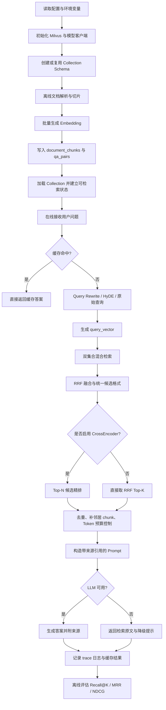

**实现顺序建议**：

1. 先实现最小可用链路：配置读取 → 建表 → 文档入库 → 单集合 hybrid_search → Prompt → LLM。
2. 再扩展双集合：`document_chunks` + `qa_pairs` 并行检索，统一候选结构。
3. 再加质量增强：Query Rewrite、RRF 后 CrossEncoder、去重、small-to-big。
4. 最后补工程能力：缓存、降级、trace 日志、离线评估。

---

### 14.2 第 0 步：配置与目录结构

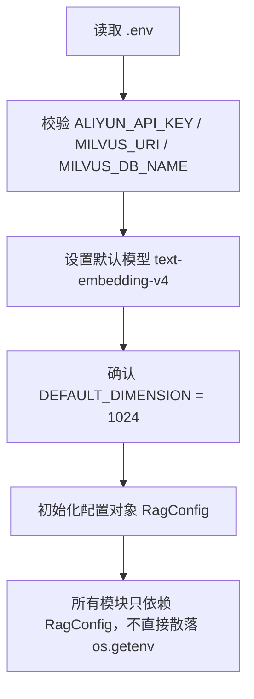

**要做的事**：

| 项目 | 要求 |
|---|---|
| 配置入口 | 建议统一放在 `config.py` 或复用 `rag_examples.milvus_config`。 |
| 环境变量 | `MILVUS_URI`、`MILVUS_DB_NAME`、`ALIYUN_API_KEY` 必须从环境变量读取。 |
| 默认值 | Milvus 默认 `http://localhost:19530`，数据库默认 `default`，向量维度默认 `1024`。 |
| 禁止项 | 不允许硬编码 IP、API Key、数据库名、模型密钥。 |
| 维度约束 | 只要 Collection 是 1024 维，就只能写入 1024 维向量。降级模型维度不一致时，必须走新 Collection 或纯 BM25。 |

**建议模块**：

```text
rag_app/
  config.py              # 读取环境变量和默认参数
  clients.py             # 初始化 Milvus、Embedding、LLM、Reranker
  schemas.py             # 创建 Collection Schema
  ingestion.py           # 文档解析、切片、入库
  retrieval.py           # 混合检索、双集合检索、RRF 结果统一
  rerank.py              # CrossEncoder 精排
  prompt_builder.py      # 上下文去重、Token 预算、Prompt 组装
  generation.py          # LLM 调用与降级返回
  evaluation.py          # Recall@K、MRR、NDCG
```

**验收标准**：

- 运行程序时，缺少 API Key 不会崩溃，可以进入 mock 或 BM25 降级模式。
- 打印配置时不会泄露完整 API Key，只显示是否已配置。
- 任意地方需要维度时，都引用 `DEFAULT_DIMENSION`，不要写死散落的 `1024`。

---

### 14.3 第 1 步：Schema 与 Collection 创建

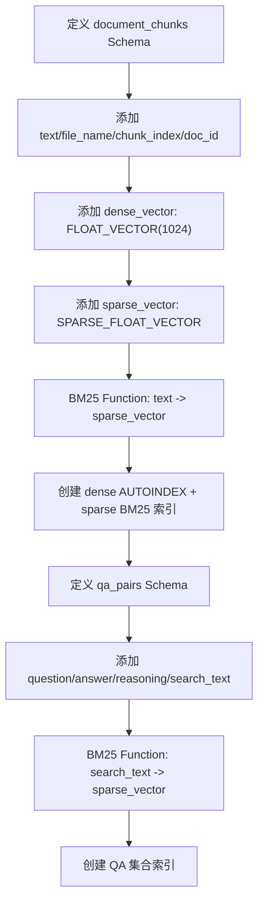

**`document_chunks` 字段建议**：

| 字段 | 类型 | 必选 | 说明 |
|---|---|---:|---|
| `id` | INT64 auto_id | 是 | Milvus 主键。 |
| `doc_id` | VARCHAR | 是 | 原始文档 ID，用于追溯和相邻 chunk 合并。 |
| `text` | VARCHAR | 是 | 切片文本，开启 `enable_analyzer` 和 `enable_match`。 |
| `file_name` | VARCHAR | 是 | 来源文件名。 |
| `chunk_index` | INT32 | 是 | 当前 chunk 在文档中的序号。 |
| `total_chunks` | INT32 | 建议 | small-to-big 时判断边界。 |
| `source_type` | VARCHAR | 建议 | 文档类型，如 `pdf`、`md`、`docx`、`web`。 |
| `created_at` | INT64 | 建议 | 时间过滤和缓存失效用。 |
| `dense_vector` | FLOAT_VECTOR | 是 | 1024 维语义向量。 |
| `sparse_vector` | SPARSE_FLOAT_VECTOR | 是 | Milvus BM25 Function 自动生成。 |

**`qa_pairs` 字段建议**：

| 字段 | 类型 | 必选 | 说明 |
|---|---|---:|---|
| `qa_id` | INT64 auto_id | 是 | Milvus 主键。 |
| `question` | VARCHAR | 是 | 标准问题。 |
| `answer` | VARCHAR | 是 | 标准答案。 |
| `reasoning` | VARCHAR | 建议 | 推理过程或答案依据。 |
| `search_text` | VARCHAR | 是 | `question + answer + reasoning`，专门用于 BM25。 |
| `source_doc_id` | VARCHAR | 建议 | QA 来自哪个文档。 |
| `dense_vector` | FLOAT_VECTOR | 是 | 推荐用 `question` 或 `question + answer` 生成。 |
| `sparse_vector` | SPARSE_FLOAT_VECTOR | 是 | 由 `search_text` 自动生成。 |

**实现细节**：

- `text` 和 `search_text` 必须设置 `enable_analyzer=True, enable_match=True`。
- 插入数据时不要手动传 `sparse_vector`，它由 BM25 Function 自动生成。
- 开发环境可以先 drop 后 create；生产环境不要随意 drop，应该做 schema 迁移或新集合灰度。
- `output_fields` 要包含后续 Prompt 需要的字段，例如 `text`、`file_name`、`chunk_index`、`question`、`answer`。

**验收标准**：

- 两个集合都能 `load_collection()` 成功。
- 纯稠密检索、纯 BM25 检索、hybrid_search 都能返回结果。
- 插入一条没有 `dense_vector` 的数据应该被校验拦截，不能写入脏数据。

---

### 14.4 第 2 步：离线文档解析、切片与入库

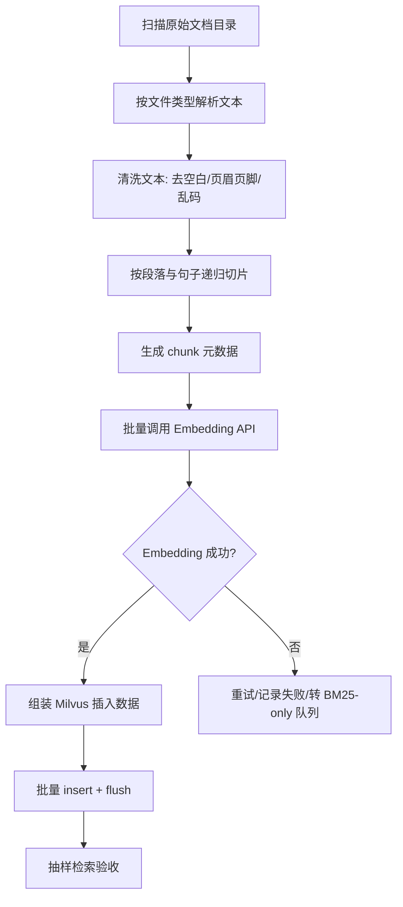

**文档处理要点**：

| 阶段 | 应该做什么 |
|---|---|
| 解析 | PDF、Markdown、TXT、Word 分别用可靠解析器，不要把二进制文件当文本读。 |
| 清洗 | 去掉连续空行、页码、页眉页脚、无意义符号；保留标题层级。 |
| 切片 | 默认 `chunk_size=500`、`chunk_overlap=50`，优先按段落、换行、句号切。 |
| 元数据 | 每个 chunk 必须带 `doc_id`、`file_name`、`chunk_index`、`total_chunks`。 |
| 去重 | 可按 `doc_id + chunk_index` 或内容 hash 避免重复入库。 |
| 批量 | Embedding 批量大小建议 20-25；Milvus insert 批量建议 100-1000。 |

**Embedding 处理规则**：

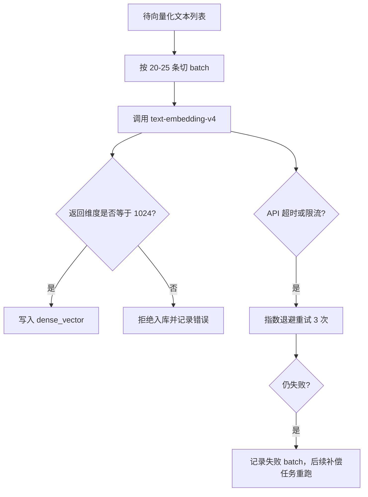

**AI 实现时的函数建议**：

| 函数 | 输入 | 输出 | 职责 |
|---|---|---|---|
| `load_documents(path)` | 文档目录 | 原始文档列表 | 读取文件和基础元数据。 |
| `clean_text(text)` | 原始文本 | 清洗后文本 | 去噪但不改写语义。 |
| `split_document(doc)` | 单篇文档 | chunk 列表 | 生成 `doc_id/chunk_index/total_chunks`。 |
| `embed_texts(texts)` | 文本列表 | 向量列表 | 批量调用 Embedding 并校验维度。 |
| `insert_chunks(chunks, vectors)` | chunk 与向量 | 插入结果 | 写入 `document_chunks`。 |
| `build_qa_pairs(chunks)` | chunk 或人工 QA | QA 列表 | 可选：生成或导入结构化问答。 |

**验收标准**：

- 随机抽 5 个 chunk，来源文件名和 chunk 序号正确。
- 任意 chunk 的 `dense_vector` 长度都是 1024。
- 用文档中的关键词做 BM25 检索，可以命中文档。
- 用同义表达做向量检索，可以召回语义相关文档。

---

### 14.5 第 3 步：在线查询预处理

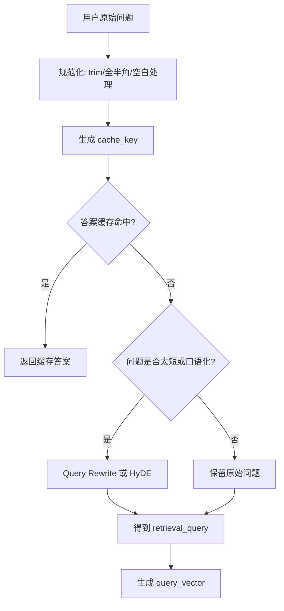

**查询改写原则**：

- 改写只服务检索，不要改变用户意图。
- 专有名词、产品名、代码符号必须保留。
- 输出要短，尽量关键词密集。
- 最好同时保留 `original_query` 和 `retrieval_query`：前者给 LLM 回答，后者给检索。

**策略选择**：

| 场景 | 推荐策略 |
|---|---|
| 用户问题清楚，包含关键词 | 不改写或轻规则改写。 |
| 问题口语化、含代词 | LLM Rewrite。 |
| 查询极短，如“Milvus” | HyDE 或 Multi-Query。 |
| 高召回要求 | Multi-Query + 结果去重。 |
| 延迟敏感 | 先查缓存；未命中时跳过 LLM Rewrite，直接检索。 |

**缓存设计提醒**：

- `lru_cache` 只适合本地演示，不适合多进程生产环境。
- 生产建议用 Redis，并把知识库版本号加入 cache key：`hash(query + kb_version + strategy_version)`。
- 文档更新后必须让检索缓存和答案缓存失效。

**验收标准**：

- 原始问题“那个可以做向量搜索的数据库叫啥”能改写成包含“向量数据库 Milvus”的查询。
- 改写失败时不会中断流程，自动使用原始问题检索。
- trace 日志中同时记录 `original_query` 与 `retrieval_query`。

---

### 14.6 第 4 步：双集合混合检索

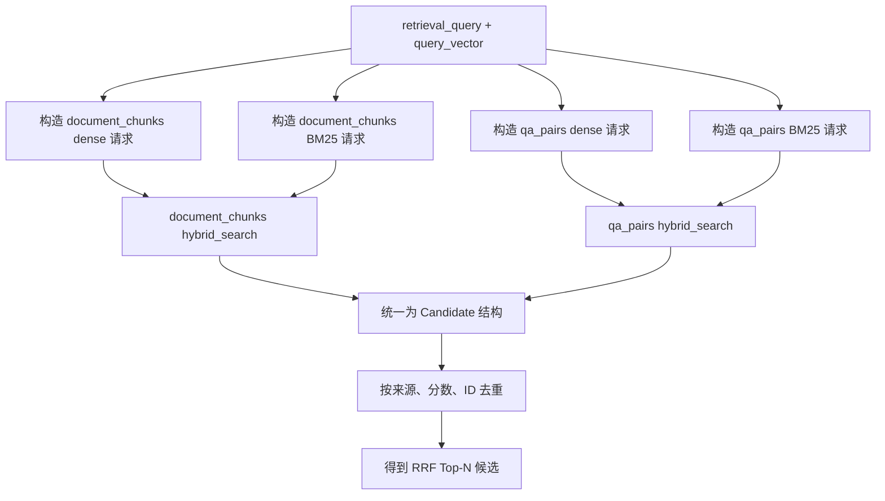

**Candidate 统一结构**：

```python
{
    "id": "milvus_id 或业务 id",
    "source": "document_chunks | qa_pairs",
    "text": "用于精排和 Prompt 的主体文本",
    "title": "标题或问题",
    "score": 0.0,
    "file_name": "来源文件",
    "doc_id": "原始文档 ID",
    "chunk_index": 3,
    "metadata": {"created_at": 1718697600, "source_type": "md"},
}
```

**实现细节**：

- `AnnSearchRequest` 的稀疏检索 `data` 传文本，不传向量。
- RRF 的 `limit` 建议取 10-20，给 CrossEncoder 留候选空间。
- 若只需要快，可以直接取 RRF Top-K。
- 标量过滤放在 `hybrid_search(filter=...)`，例如类别、权限、时间范围。
- 双集合“并行”要用线程池或异步封装；否则只是顺序调用。

**权限与过滤必须前置**：

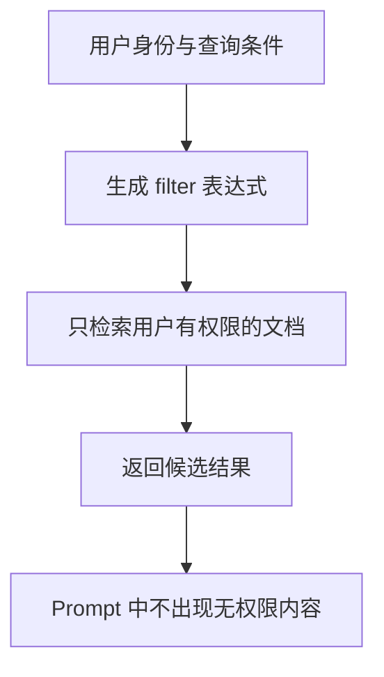

**验收标准**：

- 文档集合和 QA 集合都能返回结果。
- 同一个问题命中文档和 QA 时，不会重复塞进 Prompt。
- 加入 `source_type` 或 `created_at` 过滤后，返回结果符合过滤条件。

---

### 14.7 第 5 步：RRF 融合与 CrossEncoder 精排

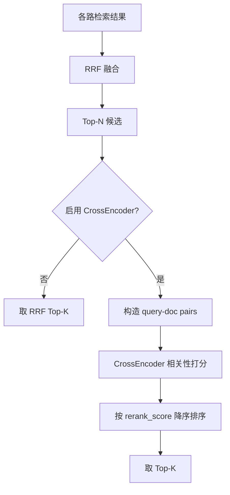

**RRF 规则**：

- RRF 用排名，不依赖不同检索方式的原始分数。
- 推荐参数 `k=60` 或 `k=100`。
- RRF 是融合，不是精排；不要写成大模型调用。

**CrossEncoder 规则**：

| 参数 | 默认建议 |
|---|---|
| 输入候选数 `N` | 10 |
| 输出结果数 `K` | 3 |
| 默认轻量模型 | `cross-encoder/ms-marco-MiniLM-L-6-v2`，偏英文；中文建议换多语言 reranker。 |
| 中文优先模型 | `BAAI/bge-reranker-v2-m3` 或同类中文 reranker。 |
| 降级策略 | 模型加载失败时跳过精排，直接使用 RRF Top-K。 |

**验收标准**：

- 开启精排后，候选结果包含 `rerank_score`。
- 精排失败不会导致问答失败。
- Top-N 候选数越大，延迟越高；日志里必须能看到 `rerank_ms`。

---

### 14.8 第 6 步：small-to-big、去重与 Token 预算

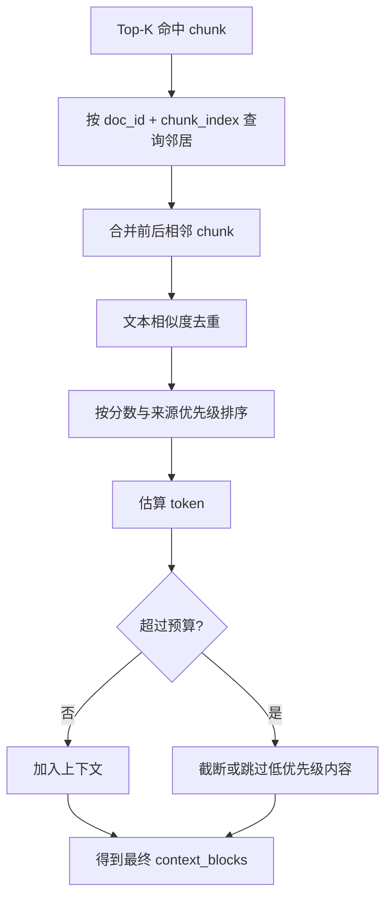

**上下文块格式建议**：

```text
[来源 1 | 文档片段 | score=0.87]
文件：milvus_intro.md
位置：chunk 3/12
内容：……

[来源 2 | 问答对 | score=0.82]
问题：……
答案：……
推理：……
```

**去重策略**：

- 第一层：相同 `doc_id + chunk_index` 去重。
- 第二层：文本 hash 去重。
- 第三层：Jaccard 或 embedding 相似度去重，阈值可用 0.85。

**Token 预算建议**：

| 项目 | 建议 |
|---|---|
| 上下文预算 | 总窗口的 40%-60%。 |
| 单条最大长度 | 每条 context block 限制 300-800 字。 |
| 优先级 | QA 精准答案 > 高分文档 chunk > 邻居 chunk > 低分结果。 |
| 截断方式 | 优先按句子截断，不要从句子中间硬截断。 |

**验收标准**：

- Prompt 不会因为检索结果过多而无限增长。
- 相邻 chunk 能补足上下文，但不会把整篇文档都塞进去。
- 每个 context block 都带来源，方便 LLM 引用。

---

### 14.9 第 7 步：Prompt 组装与 LLM 生成

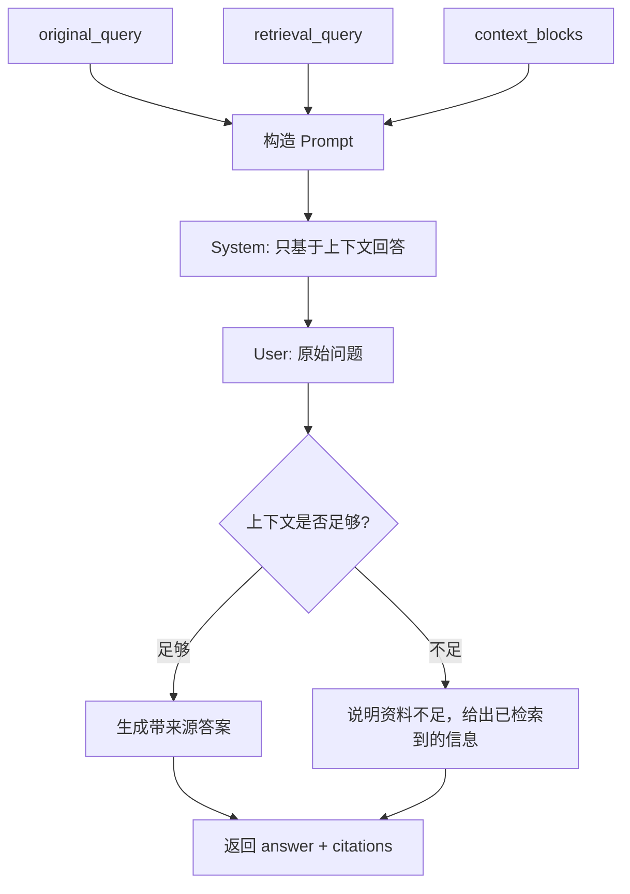

**Prompt 必须包含的约束**：

- 只能基于提供的上下文回答。
- 上下文没有答案时，要明确说“不确定”或“资料不足”。
- 回答中引用来源编号，例如 `[来源 1]`。
- 不要编造不存在的文件名、页码、链接。

**返回结构建议**：

```python
{
    "answer": "最终答案",
    "citations": [
        {"source_id": 1, "file_name": "milvus_intro.md", "chunk_index": 3}
    ],
    "retrieval_query": "改写后的查询",
    "used_context_count": 3,
    "trace_id": "本次请求 ID"
}
```

**降级策略**：

| 失败点 | 降级行为 |
|---|---|
| LLM API 不可用 | 返回 Top-K 检索原文，并提示“模型暂时不可用”。 |
| 上下文为空 | 不调用 LLM 或让 LLM 输出“知识库未检索到相关内容”。 |
| 生成超时 | 返回检索结果摘要，不让用户一直等待。 |

**验收标准**：

- 问知识库不存在的问题时，系统不会编答案。
- 答案中至少引用一个真实来源。
- 关闭 LLM API 后，系统仍能返回检索结果。

---

### 14.10 第 8 步：缓存、日志与可观测性

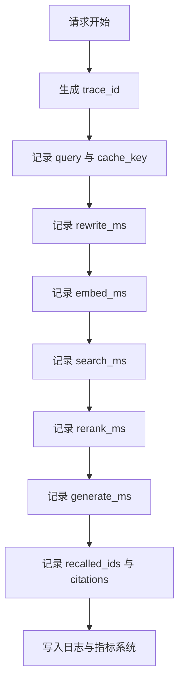

**必须记录的字段**：

| 字段 | 用途 |
|---|---|
| `trace_id` | 串起一次请求的全链路日志。 |
| `original_query` | 用户真实问题。 |
| `retrieval_query` | 改写后的检索问题。 |
| `cache_hit` | 判断缓存收益。 |
| `rewrite_ms/embed_ms/search_ms/rerank_ms/generate_ms` | 定位慢在哪一步。 |
| `recalled_ids` | 分析为什么答错。 |
| `citations` | 检查答案来源。 |
| `fallback_reason` | 记录降级原因。 |

**缓存层设计**：

| 缓存 | Key | Value | 失效条件 |
|---|---|---|---|
| Query Embedding | `embed:{model}:{query_hash}` | query_vector | 模型版本变化。 |
| 检索结果 | `search:{kb_version}:{strategy}:{query_hash}` | Top-K candidates | 文档更新、策略变化。 |
| LLM 答案 | `answer:{kb_version}:{prompt_version}:{query_hash}:{context_hash}` | answer | 文档更新、Prompt 改版。 |

**验收标准**：

- 任意一次回答都能通过 `trace_id` 查到检索和生成过程。
- 缓存命中时可以看到跳过了哪些步骤。
- 文档更新后，旧缓存不会继续污染答案。

---

### 14.11 第 9 步：离线评估与上线验收

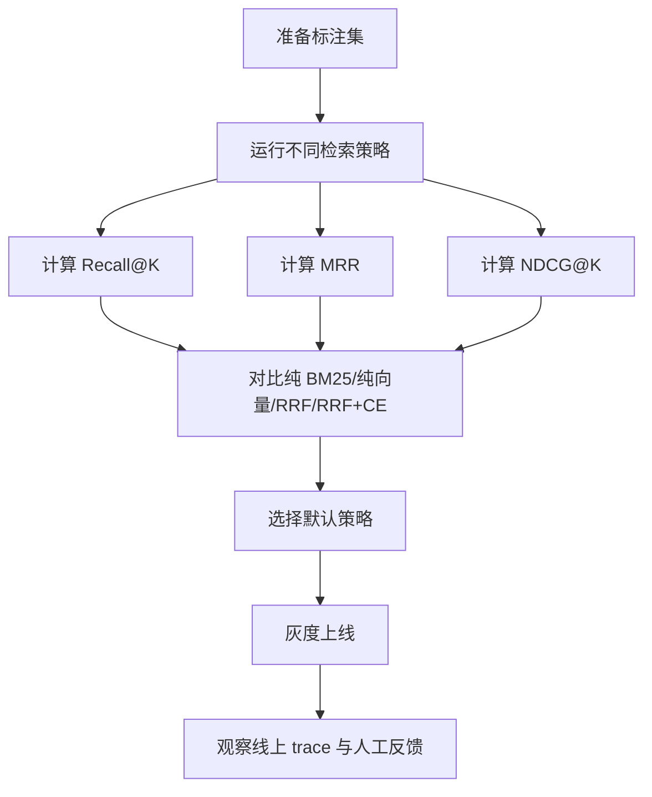

**标注集格式建议**：

```python
[
    {
        "query": "Milvus 支持哪些检索方式？",
        "relevant_ids": ["doc_milvus_003", "qa_001"],
        "must_contain": ["稠密向量", "BM25", "混合检索"]
    }
]
```

**至少评估四组策略**：

| 策略 | 目的 |
|---|---|
| 纯 BM25 | 看关键词检索下限。 |
| 纯向量 | 看语义检索能力。 |
| RRF 混合 | 默认生产候选。 |
| RRF + CrossEncoder | 看精排收益是否值得延迟。 |

**上线门槛建议**：

- Recall@5 明显高于纯 BM25 和纯向量。
- MRR 有提升，说明最佳结果更靠前。
- 人工抽查 20-50 个问题，答案来源真实、不乱编。
- P95 延迟在业务可接受范围内。
- 降级链路经过测试，不会因为 API 挂掉而整个服务不可用。

---

### 14.12 最终交付清单

把这套架构丢给 AI 实现时，可以直接要求它按下面清单交付：

- [ ] `config.py`：统一读取环境变量，校验 `DEFAULT_DIMENSION=1024`。
- [ ] `clients.py`：初始化 Milvus、Embedding、LLM、可选 CrossEncoder。
- [ ] `schemas.py`：创建 `document_chunks` 和 `qa_pairs` 两个 Collection。
- [ ] `ingestion.py`：完成文档解析、清洗、切片、批量 Embedding、批量入库。
- [ ] `retrieval.py`：实现 Query Rewrite、双集合 hybrid_search、RRF 候选统一。
- [ ] `rerank.py`：实现可选 CrossEncoder 精排，失败时自动跳过。
- [ ] `prompt_builder.py`：实现 small-to-big、去重、Token 预算、来源格式化。
- [ ] `generation.py`：实现 LLM 生成、引用来源、无上下文/LLM 失败降级。
- [ ] `cache.py`：实现 Embedding、检索结果、答案三层缓存。
- [ ] `tracing.py`：记录每阶段耗时、召回 ID、降级原因。
- [ ] `evaluation.py`：实现 Recall@K、MRR、NDCG@K，并支持多策略对比。
- [ ] `tests/`：至少覆盖建表、入库、检索、无 API Key 降级、Prompt 不超预算。

最终效果应该是：**给定一批文档和一批问题，系统能自动入库、混合检索、精排、生成带来源答案，并能通过日志和评估指标说明“为什么这么答、答得好不好、慢在哪一步”。**
