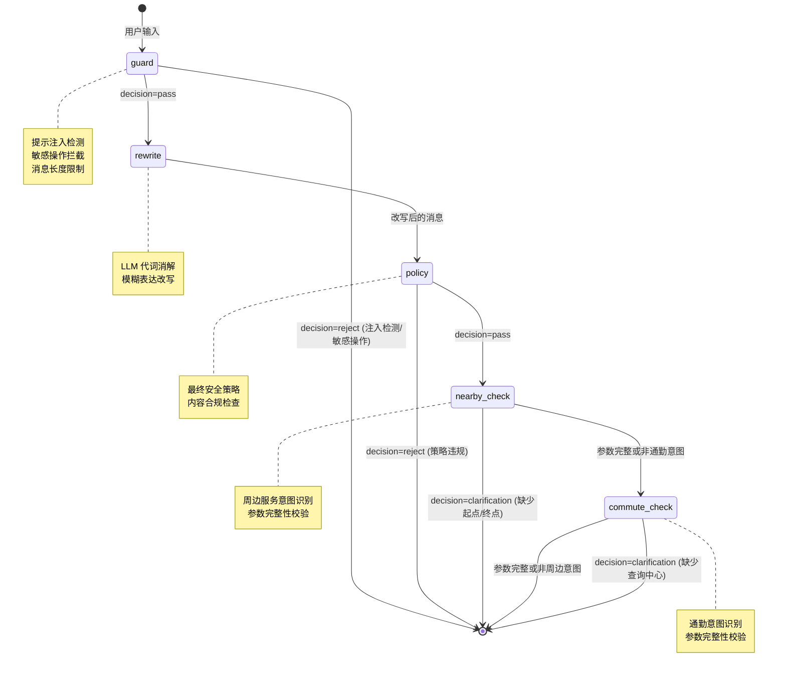

# Agent 中间件管道

## 为什么需要它

用户输入进入 Agent 之前，需要经过多层安全和质量检查。如果把这些检查散布在业务代码中，会导致：

1. **检查遗漏**：加了新入口忘记加安全检查
2. **顺序依赖混乱**：改写必须在安全检查之后，但没法强制
3. **重复代码**：每个入口都要写一遍相同的检查逻辑
4. **可测试性差**：无法单独测试每个检查节点的行为

Agent 中间件管道解决：**用状态图将所有前置检查串成一条确定的管线，每个节点职责单一，管线顺序不可绕过。**

适用场景：
- 任何接收用户输入并转发给 LLM 的系统
- 需要多层安全检查的 API Gateway
- 输入预处理管道（清洗 → 改写 → 校验）

---

## 本项目中的应用

本项目使用 LangGraph `StateGraph` 构建了一条 5 节点中间件管道：

```
guard → rewrite → policy → nearby_check → commute_check
```

每个节点独立判断，如果 `decision == "reject"` 则管线提前终止。

设计决策：

| 决策 | 原因 |
|------|------|
| 用 LangGraph 而非手写 if/else | 状态图可可视化、可测试、可独立演化每个节点 |
| 每个节点返回 `decision` + `reason` | 执行器统一判断是否继续，无需知道内部逻辑 |
| 管线结果缓存（`@lru_cache`） | 同一个进程内管线图只构建一次 |
| `nearby_check` 和 `commute_check` 放在最后 | 它们在 guard/policy 通过后才做意图识别，避免无效解析 |

---

## 实现流程



---

## 核心实现

### 1. 管线图构建（缓存单例）

```python
# agent_system/middleware/middleware_graph.py
@lru_cache(maxsize=1)
def _build_graph():
    builder = StateGraph(MiddlewareState)
    builder.add_node("guard", _guard_node)
    builder.add_node("rewrite", _rewrite_node)
    builder.add_node("policy", _policy_node)
    builder.add_node("nearby", _nearby_node)
    builder.add_node("commute", _commute_node)
    builder.set_entry_point("guard")
    builder.add_conditional_edges("guard", _stop_if_not_pass, 
        {"stop": END, "next": "rewrite"})
    builder.add_edge("rewrite", "policy")
    builder.add_conditional_edges("policy", _stop_if_not_pass, 
        {"stop": END, "next": "nearby"})
    builder.add_conditional_edges("nearby", _stop_if_not_pass, 
        {"stop": END, "next": "commute"})
    builder.add_edge("commute", END)
    return builder.compile()
```

### 2. 统一状态结构

```python
class MiddlewareState(TypedDict, total=False):
    message: str          # 原始用户输入
    history: list | None  # 对话历史
    decision: str         # "pass" | "reject" | "rewrite" | "clarification"
    reason: str | None    # 拒绝原因
    rewritten: str | None # 改写后的消息
    clarification: str | None  # 需要用户补充的信息
    metadata: dict        # 各节点附加的元数据
```

### 3. 输入守卫节点（正则匹配，非 LLM）

```python
# agent_system/middleware/input_guard.py
_INJECTION_PATTERNS = [
    r"ignore\s+(all\s+)?(previous|prior|above|before)\s+(instructions?|...)",
    r"<\|im_start\|>",
    r"<\|im_end\|>",
    r"\[system\]",
    r"jailbreak",
    r"忘记.*(?:规则|指令|限制|设定)",
    # ...
]

def check(message: str) -> MiddlewareResult:
    if len(message) > MAX_MESSAGE_LENGTH:
        return MiddlewareResult(decision="reject", reject_reason="消息过长")
    for pat in _INJECTION_PATTERNS:
        if re.search(pat, message.lower()):
            return MiddlewareResult(decision="reject", reject_reason="输入包含不被允许的内容")
    return MiddlewareResult(decision="pass")
```

### 4. 查询改写节点（LLM 辅助）

```python
# agent_system/middleware/query_rewriter.py
def check(message: str, history: list | None = None) -> MiddlewareResult:
    # 代词语义消解："他上次的成绩" → "张三上次的考试成绩"
    # 只有检测到需要改写时才调用 LLM
    if _needs_rewrite(message):
        rewritten = _llm_rewrite(message, history)
        return MiddlewareResult(decision="rewrite", rewritten_message=rewritten)
    return MiddlewareResult(decision="pass")
```

### 5. 管线执行入口

```python
def run_agent_middleware(message: str, history: list | None = None) -> dict:
    graph = _build_graph()
    state = graph.invoke({"message": message, "history": history or [], ...})
    return {
        "decision": state.get("decision"),
        "reason": state.get("reason"),
        "rewritten": state.get("rewritten"),
        "clarification": state.get("clarification"),
        "metadata": state.get("metadata") or {},
    }
```

---

## 最佳实践

### 应该这样设计
- **每个节点只做一件事**：guard 管安全，rewrite 管消解，policy 管合规——职责单一
- **失败即停止**：`guard` 或 `policy` 返回 reject 后，后续节点不执行（节省 LLM 调用）
- **用状态图而非 if/else**：新增节点只需 `add_node` + `add_edge`，无需改动现有节点
- **状态图缓存**：`@lru_cache(maxsize=1)` 避免每次请求都重新编译图
- **澄清类意图放在最后**：只在安全检查通过后才做意图识别和参数补全

### 不应该这样设计
- 不要让每个节点都调用 LLM（guard 用正则，只有 rewrite 用 LLM）
- 不要在节点之间共享可变状态（每个节点只读入、写入自己的字段）
- 不要把业务逻辑放进中间件（中间件只做"能不能继续"的判断）

### 常见踩坑
- **改写不能改变语义**：query_rewriter 只消解代词和模糊表达，不做意图归类
- **拒绝原因要对用户友好**：`"输入包含不被允许的内容"` 而不暴露具体匹配规则（防绕过）

---

## 面试亮点

**面试官可能追问：**
> "为什么用 LangGraph 而不是 FastAPI middleware？"

回答：LangGraph 提供的是业务级管线编排（有状态、有条件分支、可暂停），FastAPI middleware 是 HTTP 级拦截。两者不冲突——FastAPI middleware 做认证和日志，LangGraph 做内容安全和意图预处理。

> "中间件节点失败了怎么办？"

回答：guard 和 policy 用正则，不依赖外部服务。只有 rewrite 调用 LLM，如果 LLM 失败，`_needs_rewrite()` 判断为不需要改写则直接透传，不会阻塞。

---

## 可以迁移到哪些项目

- 聊天机器人（输入安全过滤）
- AI 客服（敏感词过滤 + 意图预处理）
- API Gateway（内容安全管线）
- Agent 平台（通用中间件框架）
- 内容审核系统（多级审核管道）

---

## 标签

#Agent #中间件 #LangGraph #安全 #管线
