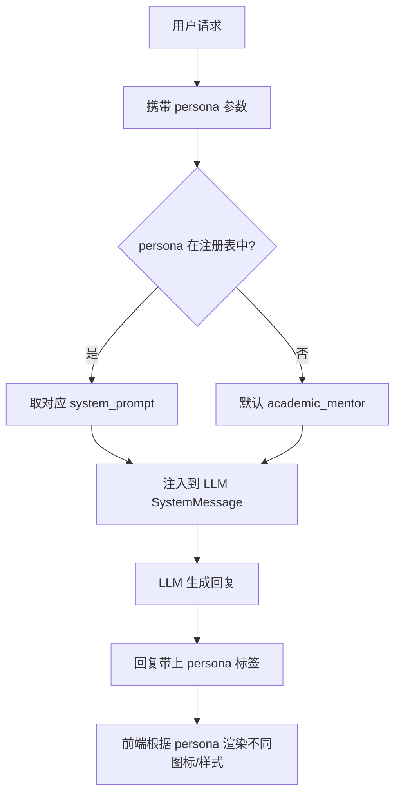

# Agent 角色人设系统

## 为什么需要它

AI Agent 如果只有一个固定语气，无法适应不同场景：

1. **学生查成绩**需要温和鼓励的老师语气
2. **学生情绪低落**需要共情陪伴的班主任语气
3. **学生犯错需要纠正**需要亲切但有原则的兄长语气

角色人设系统解决：**通过预定义的 System Prompt 模板 + 注册表，让同一个 Agent 在不同场景下以不同角色风格回复。**

适用场景：
- 教育类 AI（教师 / 班主任 / 辅导员多角色）
- AI 客服（专业客服 / 售后 / 投诉处理不同语气）
- 虚拟人（不同性格的虚拟角色）
- 企业内部 AI（对不同职级的员工用不同沟通风格）

---

## 本项目中的应用

本项目定义了 3 种角色，每种角色有完整的：

- **System Prompt**（约 200-400 字，结构化描述身份、风格、能力、边界）
- **注册元数据**（名称、图标、一句话描述）
- **角色切换**（前端选择，后端根据 `persona` 参数注入对应 Prompt）

| 角色 | 适用场景 | 风格关键词 |
|------|---------|-----------|
| `academic_mentor`（学业导师） | 成绩查询、学业分析 | 温和、鼓励、先肯定后建议 |
| `companion_head_teacher`（陪伴班主任） | 压力倾诉、拖延、焦虑 | 共情、拆解问题、小步骤建议 |
| `xinge`（昕哥） | 错误复盘、技术问题 | 亲切、有原则、引经据典 |

---

## 实现流程



---

## 核心实现

### 1. 角色 Prompt 结构

每个角色的 System Prompt 包含四个固定模块：

```
1. 你的身份：[角色定位，一句话说清楚]
2. 你的说话风格：[语气、用词、段落长度、特定表达习惯]
3. 你的能力范围：[能做什么，说得具体]
4. 你的边界：[不能做什么，说得明确]
```

示例（陪伴班主任的边界定义）：

```
你的边界：
- 不做心理疾病诊断，不承诺治疗效果
- 不承诺"绝对保密"；当学生表达自伤、伤人或现实危险时，
  要建议立刻联系身边可信任成年人、学校老师、家长或当地紧急求助渠道
- 不替学生做重大人生决定，只帮助学生澄清选择和下一步行动
- 不编造学校政策、联系方式或外部资源；不确定时坦诚说明
```

### 2. 注册表模式

```python
# agent_system/prompts/persona_prompt.py
PERSONA_REGISTRY = {
    "academic_mentor": {
        "name": "学业导师",
        "icon": "🎓",
        "description": "温和鼓励的学业导师，擅长成绩分析与学习指导",
        "system_prompt": ACADEMIC_MENTOR_PERSONA,
    },
    "companion_head_teacher": {
        "name": "陪伴班主任",
        "icon": "🌿",
        "description": "共情陪伴型班主任，适合聊压力、拖延、考试焦虑",
        "system_prompt": COMPANION_HEAD_TEACHER_PERSONA,
    },
    "xinge": {
        "name": "昕哥",
        "icon": "😎",
        "description": "爱鼓励人的好老师好兄弟，擅长复盘错误、讲清后果",
        "system_prompt": XINGE_PERSONA,
    },
}
```

### 3. 角色注入

```python
# agent_system/executor/agent_executor.py
def _get_persona_prompt(persona: str) -> str:
    entry = PERSONA_REGISTRY.get(persona)
    if entry:
        return entry["system_prompt"]
    return PERSONA_REGISTRY["academic_mentor"]["system_prompt"]  # 默认角色

# 在构建 LLM 消息时注入
persona_prompt = _get_persona_prompt(persona)
system_prompt = f"{persona_prompt}\n\n当前任务：{instruction}\n..."
```

### 4. 风格标签（辅助）

```python
def _infer_style(persona: str) -> str:
    if persona == "companion_head_teacher":
        return "supportive"
    return "academic"
```

---

## 最佳实践

### 应该这样设计
- **四段式 Prompt 结构**：身份 → 风格 → 能力 → 边界，每个角色保持相同结构，便于对比和维护
- **注册表而非硬编码**：新增角色只需加一个 entry，不改任何业务代码
- **默认角色兜底**：`persona` 参数无效时回退到默认角色，不报错
- **边界比能力更重要**：安全边界是角色人设的关键价值——明确说"不能做什么"比"能做什么"更重要

### 不应该这样设计
- 不要把角色人设写在业务代码里（如 `if persona == "x": prompt = "..."`）
- 不要让角色 Prompt 过于简短（太短的角色描述无法约束 LLM 行为）
- 不要让角色 Prompt 包含具体的业务流程（角色定义是"怎么说话"，不是"做什么事"）

### 常见踩坑
- **角色 Prompt 太长会挤压有用 token**：控制在 200-400 字
- **边界模糊导致角色越界**：陪伴班主任的 Prompt 花了一半篇幅在定义边界
- **角色切换应该无状态**：不要因为切换角色而丢失对话上下文（角色只影响回复风格，不影响记忆内容）

---

## 面试亮点

**面试官可能追问：**
> "为什么不直接用 Few-shot 示例定义角色？"

回答：Few-shot 适合定义"格式"（如输出 JSON 结构），但 System Prompt 更适合定义"风格"——后者需要的是稳定的行为约束，而不是模仿几个例子。示例的覆盖面有限，而结构化的边界定义能覆盖更多边界情况。

> "三个角色的 System Prompt 有多少重叠？"

回答：身份和边界各有不同，能力范围也有差异。共性是四段式结构。我们没有抽取"公共 Prompt"因为每个角色的边界定义差异很大（如陪伴班主任有九条特定边界），合并反而增加维护复杂度。

---

## 可以迁移到哪些项目

- 教育 AI（教师/辅导员/班主任多角色）
- AI 客服（不同沟通风格）
- 虚拟人/数字人（角色扮演）
- 企业内部 AI（高管/员工/外部伙伴不同语气）
- 游戏 NPC（不同性格的角色对话）

---

## 标签

#Agent #Persona #Prompt #角色系统 #SystemPrompt
