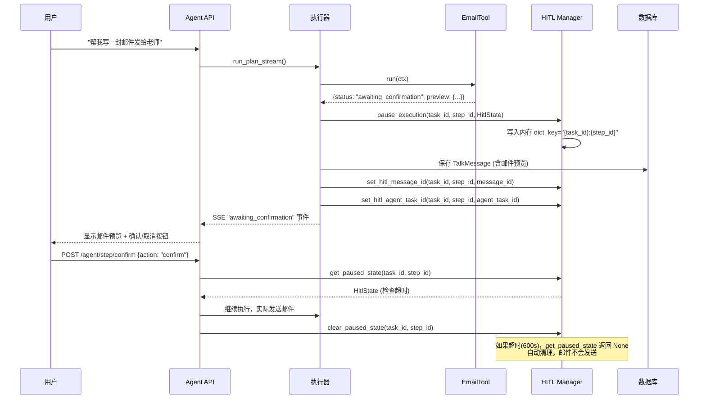

# HITL 人机协同

## 为什么需要它

Agent 自动执行高风险操作（发送邮件、删除数据、对外发布内容）时，存在两个不可接受的风险：

1. **误操作不可逆**：Agent 理解偏差导致发错邮件、删错数据
2. **合规要求**：某些操作必须有人类审批才能执行（如 GDPR 下的数据导出）

HITL (Human-in-the-Loop) 解决：**在高风险操作执行前插入人类确认节点，确认后才继续执行。**

适用场景：
- 邮件发送、短信推送（内容需要人工审核）
- 数据删除、批量修改（不可逆操作）
- 对外发布内容（合规审查）
- 金额操作（支付、退款）

---

## 本项目中的应用

本项目 HITL 应用于邮件发送场景。用户在 Agent 中生成邮件后，系统暂停执行并等待用户确认，确认后才实际发送。

核心设计：

| 特性 | 实现 |
|------|------|
| 触发方式 | 工具返回 `status: "awaiting_confirmation"` |
| 暂停机制 | 内存 dict 存储 HitlState |
| 超时兜底 | 默认 600 秒 TTL，超时自动清理 |
| 恢复路径 | `/agent/step/confirm` API 端点 |
| 规则配置 | `escalation_rules.py` 按工具名配置风险等级和确认文案 |
| 状态关联 | 关联 TalkMessage ID 和 AgentTask ID，支持回写 |

---

## 实现流程



---

## 核心实现

### 1. 暂停状态存储

```python
# agent_system/hitl/hitl_manager.py
_paused_states: dict[str, HitlState] = {}
DEFAULT_TTL_SECONDS = 600

def pause_execution(task_id: str, step_id: int, state: HitlState) -> None:
    key = f"{task_id}:{step_id}"
    if state.expires_at is None:
        state.expires_at = state.paused_at + (state.timeout_seconds or DEFAULT_TTL_SECONDS)
    _paused_states[key] = state

def get_paused_state(task_id: str, step_id: int) -> HitlState | None:
    key = f"{task_id}:{step_id}"
    state = _paused_states.get(key)
    if state is None:
        return None
    if time.time() > state.expires_at:
        del _paused_states[key]
        return None  # 超时自动清理
    return state
```

### 2. 风险规则配置

```python
# agent_system/hitl/escalation_rules.py
# 每个需要 HITL 的工具定义：风险等级、确认文案、超时时间
HITL_RULES = {
    "email_tool": HitlRule(
        tool_name="email_tool",
        risk_level="high",
        timeout_seconds=600,
        confirm_title="确认发送邮件",
        confirm_message="请确认邮件内容和收件人",
    ),
}
```

### 3. 执行器中的 HITL 检测

```python
# agent_system/executor/agent_executor.py
if result.get("status") == "awaiting_confirmation":
    rule = get_hitl_rule(step.tool_name)
    yield _sse_event("awaiting_confirmation", build_hitl_payload(...))
    pause_execution(task_id, step_id, HitlState(...))
    break  # 流在此结束，不继续执行后续步骤
```

### 4. 状态关联（可追溯）

```python
def set_hitl_message_id(task_id, step_id, message_id):
    """关联 TalkMessage，confirm 端点可据此回写结果"""

def set_hitl_agent_task_id(task_id, step_id, agent_task_id):
    """关联 AgentTask，confirm 端点可据此更新监控状态"""
```

---

## 最佳实践

### 应该这样设计
- **超时必兜底**：每个 HITL 状态必须有 TTL，超时自动清理，避免内存泄漏
- **关联业务 ID**：HITL 状态关联 Message 和 Task 的数据库 ID，确认/取消后可回写完整记录
- **SSE 事件通知**：暂停时通过 SSE 推送 `awaiting_confirmation` 事件，前端据此渲染确认 UI
- **规则表驱动**：HITL 规则按工具名配置，新增需要确认的工具只需加一行规则

### 不应该这样设计
- 不要把 HITL 逻辑写在执行器里（应该是工具返回状态 + 执行器检测状态）
- 不要用数据库存 HITL 状态（暂停恢复是高频短生命周期操作，内存更合适）
- 不要让 HITL 阻塞所有后续请求（`break` 退出当前执行，但 session 仍可接受新消息）

### 常见踩坑
- **内存存储的单机限制**：当前用 dict 存储，多实例部署时确认请求可能路由到另一台机器。生产环境应迁移到 Redis
- **超时时间不要太短**：用户可能需要仔细阅读邮件内容再确认，600 秒比较合理

### 演进路径
- **当前**：内存 dict，仅 email_tool
- **下一步**：Redis 存储，支持多实例
- **远期**：支持多步确认（工作流审批链）

---

## 面试亮点

**面试官可能追问：**
> "HITL 暂停后如果用户不确认怎么办？"

回答：有 TTL 超时机制（默认 600 秒），超时后状态自动清理，邮件不会发送。前端也会显示倒计时。用户下次发消息时 session 继续正常工作。

> "为什么用内存而不用数据库？"

回答：HITL 状态是临时性的（最多 10 分钟生命周期），用数据库反而增加延迟和复杂度。当前单机部署足够，多机部署时迁移到 Redis（代码已预留 `# 后续可迁移到 Redis` 注释）。

---

## 可以迁移到哪些项目

- AI 客服（敏感操作确认）
- 工作流审批引擎
- Agent 平台（通用 HITL 能力）
- RPA 自动化（高危操作确认）
- 财务系统（支付审批）
- CRM（批量操作确认）

---

## 标签

#Agent #HITL #人机协同 #安全 #审批
