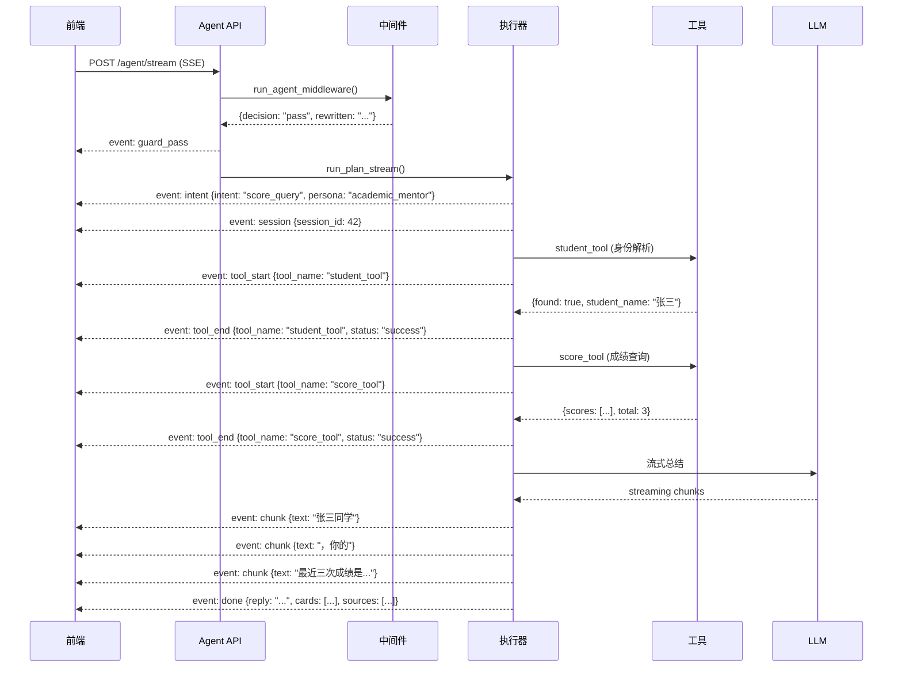

# SSE 流式输出协议

## 为什么需要它

Agent 执行任务时，如果等所有步骤完成后才返回结果，用户体验极差：

1. **等待焦虑**：用户不知道 Agent 在做什么，可能以为系统卡死
2. **无法中断**：如果中间步骤出错，用户要等全部执行完才知道
3. **无法确认**：高风险操作（如发邮件）需要中间暂停等待用户确认

SSE (Server-Sent Events) 流式输出解决：**让 Agent 实时推送执行进度，前端逐步渲染结果。**

适用场景：
- Agent 多步骤任务执行
- LLM 流式文本生成
- 实时进度展示（下载、处理、分析）
- 需要中间暂停的异步任务

---

## 本项目中的应用

本项目 Agent 系统使用 SSE 协议定义了完整的事件体系：

| 事件类型 | 含义 | 前端行为 |
|---------|------|---------|
| `intent` | 意图分类结果 | 显示"正在为你查询成绩..." |
| `session` | 会话信息 | 更新 session ID |
| `plan` | 执行计划 | 可选：显示步骤预览 |
| `tool_start` | 工具开始执行 | 显示"正在查询..." |
| `tool_end` | 工具执行完毕 | 显示工具调用摘要 |
| `chunk` | LLM 流式文本 | 逐字渲染回复 |
| `done` | 执行完成 | 显示最终结果 + 卡片 + 来源 |
| `awaiting_confirmation` | 需要确认（HITL） | 显示确认/取消按钮 |
| `guard_pass` | 安全守卫通过 | 调试用，可选展示 |
| `rewritten` | 查询已被改写 | 调试用，可选展示 |

---

## 实现流程



---

## 核心实现

### 1. SSE 事件格式化

```python
# agent_system/executor/agent_executor.py
def _sse_event(event: str, data: dict | str) -> str:
    if isinstance(data, str):
        data = {"text": data}
    return f"event: {event}\ndata: {json.dumps(data, ensure_ascii=False)}\n\n"
```

### 2. FastAPI StreamingResponse 端点

```python
# agent_system/api/agent_api.py
@router.post("/agent/stream")
async def agent_chat_stream(request: AgentChatRequest):
    async def event_generator():
        for sse_text in run_plan_stream(plan, user, db, ...):
            yield sse_text
    return StreamingResponse(event_generator(), media_type="text/event-stream")
```

### 3. LLM 流式输出嵌入 SSE

```python
def _stream_reply_from_llm(plan, context, persona, provider):
    full = ""
    for text_chunk in _llm_stream_summarize(context, instruction, persona, provider):
        full += text_chunk
        yield _sse_event("chunk", text_chunk)  # 每个 chunk 包装为 SSE
    return full
```

### 4. done 事件的完整结构

```python
done_data = {
    "intent": plan.intent,
    "persona": plan.persona,
    "tool_calls": [  # 每个工具调用的结果摘要
        {"tool_name": "score_tool", "status": "success", "summary": "查询到 3 条成绩记录"}
    ],
    "sources": [  # RAG 引用来源
        {"file_name": "学生手册.md", "source_type": "document", "text_preview": "..."}
    ],
    "cards": [  # 前端卡片数据
        {"type": "weather", "data": {...}},
        {"type": "route", "data": {...}},
    ],
    "tool_monitoring": {  # 监控埋点
        "nearby_service_tool": {"provider": "mcp", "fallback_used": False}
    },
    "reply": "完整文本回复",
}
yield _sse_event("done", done_data)
```

---

## 最佳实践

### 应该这样设计
- **事件类型语义化**：`tool_start`/`tool_end` 而不是 `event_1`/`event_2`，前端按事件类型做不同渲染
- **done 事件携带完整结构化数据**：不要只返回纯文本。`cards`、`sources`、`tool_monitoring` 分别驱动前端不同组件
- **HITL 暂停时 break 流**：`awaiting_confirmation` 事件后 `break`，不再继续执行后续步骤
- **done 事件中的 reply 冗余但必要**：前端可以用它做复制、分享等操作，不需要从 chunks 拼接

### 不应该这样设计
- 不要把 SSE 用于非流式场景（普通 CRUD 用 JSON 即可）
- 不要在 SSE 流中返回 HTML（应该返回结构化 JSON，前端负责渲染）
- 不要让前端从 event name 推断业务逻辑（event name 应该是稳定协议，前端只做 UI 映射）

### 常见踩坑
- **SSE 连接超时**：nginx 默认 60s 超时，需要配置 `proxy_read_timeout` 或在中间件层发送心跳
- **chunk 事件频率**：LLM 流式 token 频率很高（~50ms/token），前端的 `marked` 渲染需要防抖

---

## 面试亮点

**面试官可能追问：**
> "为什么选 SSE 而不是 WebSocket？"

回答：SSE 是单向推送（server → client），刚好匹配 Agent 执行流程。WebSocket 是全双工，但我们不需要 client 在执行过程中频繁发消息（确认操作通过独立的 REST 端点）。SSE 实现更简单，浏览器原生支持自动重连。

---

## 可以迁移到哪些项目

- Agent 平台（流式执行进度展示）
- AI 客服（实时回复渲染）
- LLM 应用（流式文本生成）
- 实时监控面板（日志/指标流）
- 文件处理系统（处理进度推送）

---

## 标签

#Agent #SSE #流式输出 #协议设计 #实时通信
