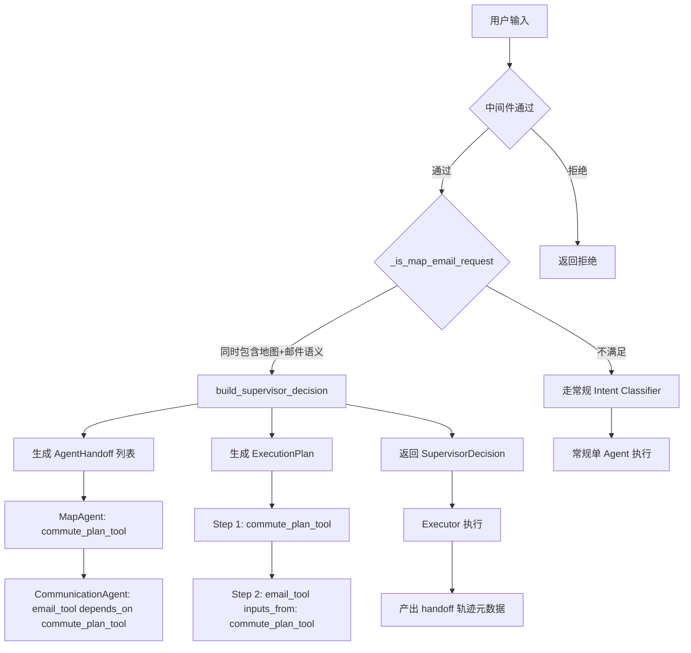

# Supervisor 多智能体路由

## 为什么需要它

单 Agent 架构面临两个扩展瓶颈：

1. **意图冲突**：用户一句话同时包含"帮我查路线并邮件通知同事"，单 Agent 难以协调多个专业工具按序执行
2. **领域耦合**：地图出行、邮件沟通、数据查询等不同领域的逻辑混在一个 Agent 里，每次加新领域都要改核心代码

Supervisor 模式解决：**如何在不改核心 Agent 的前提下，让多个专业子 Agent 协作完成跨域任务。**

适用场景：
- 用户请求跨越多个专业领域（地图 + 邮件、查询 + 通知、搜索 + 导出）
- 需要按依赖顺序编排多个工具的执行
- 未来需要持续新增子 Agent 而不影响现有系统

---

## 本项目中的应用

本项目 Supervisor 当前接管**地图出行 + 邮件沟通**的跨域场景。核心数据流：

```
用户输入 → 中间件 → Supervisor._is_map_email_request() 判断
  → 命中则产出 SupervisorDecision（含 handoff 列表 + ExecutionPlan）
  → 未命中则返回 None，走常规单 Agent 流程
```

设计原因：
- **规则驱动而非 LLM 驱动**：跨域识别用关键词匹配（`_MAP_HINTS` + `_EMAIL_HINTS`），避免 LLM 误判和不稳定
- **Handoff 是声明式描述**：`AgentHandoff` 只描述"哪个 Agent 做什么"，不包含具体执行逻辑
- **复用现有工具**：Supervisor 产出的 `ExecutionPlan` 与常规 Planner 产出的结构完全一致，执行器无需感知 Supervisor 存在

---

## 实现流程



---

## 核心实现

### 1. 跨域判断（规则驱动，非 LLM）

```python
# agent_system/supervisor/supervisor_planner.py
_MAP_HINTS = ["路线", "通勤", "怎么去", ...]
_EMAIL_HINTS = ["邮件", "发给", "发送", ...]

def _is_map_email_request(text: str) -> bool:
    has_map = any(word in text for word in _MAP_HINTS) and "从" in text
    has_email = any(word in text for word in _EMAIL_HINTS) or bool(_EMAIL_RE.search(text))
    return has_map and has_email
```

### 2. Handoff 声明（描述而非执行）

```python
@dataclass
class AgentHandoff:
    agent_role: str      # "MapAgent" | "CommunicationAgent"
    intent: str          # "commute_plan" | "email_draft"
    tool_name: str       # "commute_plan_tool" | "email_tool"
    reason: str          # 为什么要分派给这个 Agent
    depends_on: list[str]  # 依赖的前置工具
```

### 3. 轨迹元数据（可审计可监控）

```python
def to_metadata(self) -> dict:
    return {
        "mode": "supervisor",
        "intent": self.intent,
        "state_trace": self.state_trace,  # ["route", "delegate", "merge", "complete"]
        "handoffs": [...]  # 每个 handoff 的 agent_role, intent, tool_name, reason, depends_on
    }
```

### 4. 与执行器的衔接

Supervisor 产出的 `SupervisorDecision.plan` 是一个标准 `ExecutionPlan`，包含：
- `steps`: 按依赖顺序排列的 `PlanStep` 列表
- `inputs_from`: Step 2 的 `email_tool` 声明 `inputs_from=["commute_plan_tool"]`，执行器自动从前一步结果中提取参数

---

## 最佳实践

### 应该这样设计
- **规则优先于 LLM**：跨域识别用关键词/正则，不做 LLM 判断——可预测、零延迟、零幻觉
- **Handoff 是声明不是执行**：Supervisor 只描述"谁做什么"，不亲自调用工具
- **复用执行器**：Supervisor 产出的 Plan 与常规 Planner 产出的结构完全一致，执行器无需分支
- **产出的元数据可追溯**：`state_trace` 记录了 Supervisor 的决策路径，用于监控和审计

### 不应该这样设计
- 不要让 Supervisor 直接调用工具（打破分层，失去可替换性）
- 不要让 Supervisor 做 LLM 判断（延迟高、不稳定、难以调试）
- 不要为每个跨域组合写硬编码逻辑（用 handoff 声明 + depends_on 描述依赖即可）

### 演进路径
- **当前（v1）**：规则驱动，只支持 map+email 一个组合
- **下一步（v2）**：LLM-based 通用跨域分类 + 规则兜底
- **远期（v3）**：动态 Agent 注册与发现，handoff 完全由配置驱动

---

## 面试亮点

**面试官可能追问：**
> "为什么不直接用 LLM 做跨域判断？"

回答：规则匹配零延迟、100% 可预测、零幻觉。LLM 判断适合做意图细分类（12 种意图），但不适合做跨域触发判断——因为后者的判断标准是"同时包含两个领域的关键词"，规则更擅长。

> "如果用户说'帮我查路线然后发邮件'，但 Supervisor 没命中怎么办？"

回答：有双重保障。命中走 Supervisor 多 Agent 编排，未命中走常规 Intent Classifier 单 Agent 流程。而且 Planner 有 LLM + 硬编码 fallback 两层兜底，不会完全失败。

---

## 可以迁移到哪些项目

- Agent 平台（多 Agent 协作编排）
- AI 客服系统（售前 + 售后 + 物流的跨域查询）
- 工作流引擎（任务串并行编排）
- 智能助手（出行 + 邮件 + 日程的跨域联动）
- RPA 平台（多步骤自动化流程）

---

## 标签

#Agent #Supervisor #多智能体 #路由 #编排
