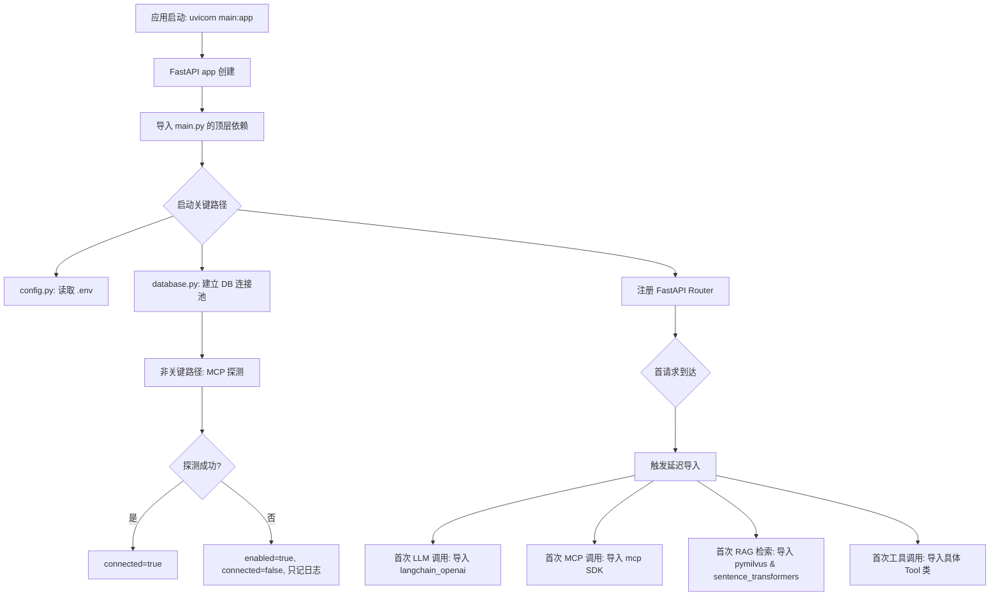

# 启动优化：延迟加载

## 为什么需要它

Python 应用随着模块增多，启动越来越慢：

1. **重依赖拖慢启动**：`langchain`、`pymilvus`、`sentence-transformers` 等 AI 库导入就要几百毫秒
2. **启动即连接外部服务**：数据库连接池、MCP 远端探测、Milvus 连接在启动时全量建立
3. **代码路径上 80% 的导入在首请求前用不到**：但它们在模块顶层 `import`，必须等

延迟加载解决：**把重依赖的导入推迟到真正使用时，把外部连接从启动关键路径移到非关键路径，让应用"先启动，再就绪"。**

适用场景：
- 包含多个可选子系统的大型 Python 应用
- AI/ML 应用（模型加载极慢）
- 微服务（启动速度影响滚动更新和扩缩容）
- 开发环境（热重载时启动慢严重影响开发体验）

---

## 本项目中的应用

本项目使用了三种延迟加载策略：

| 策略 | 应用位置 | 效果 |
|------|---------|------|
| 函数内导入 | `TencentMapMcpClient._load_sdk()` | MCP SDK 未安装时不影响启动 |
| 模块级懒加载 | `agent_system/tools/__init__.py` | 9 个工具类只在实际调用时才 import |
| 非阻塞探测 | `TencentMapMcpClient.startup()` | MCP 远端不可用时只记日志，不抛异常 |
| 启动开关控制 | `TENCENT_MAP_MCP_STARTUP_MODE` 环境变量 | 运维可随时禁用 MCP 探测 |

---

## 实现流程



---

## 核心实现

### 1. 函数内延迟导入（MCP SDK）

```python
# agent_system/tools/mcp_client.py
def _load_sdk(self):
    """延迟导入 MCP SDK；没安装时让客户端自动降级。"""
    try:
        from mcp import ClientSession
        from mcp.client.streamable_http import streamablehttp_client
    except Exception as exc:
        raise RuntimeError("未安装 MCP Python SDK") from exc
    return ClientSession, streamablehttp_client
```

### 2. 非阻塞启动探测

```python
async def startup(self) -> None:
    """应用启动时探测 MCP 可用性；失败只降级，不向外抛异常。"""
    if self.startup_mode == "disabled":
        self._mark_disabled("TENCENT_MAP_MCP_STARTUP_MODE=disabled")
        return
    try:
        ClientSession, streamablehttp_client = self._load_sdk()  # 延迟导入
        async with streamablehttp_client(self.endpoint) as (...):
            async with ClientSession(...) as session:
                await session.initialize()
                tools_result = await session.list_tools()
        self.connected = True
        self.last_error = None
    except Exception as exc:
        self.enabled = bool(self.api_key)
        self.connected = False
        self.last_error = str(exc)
        logger.warning("腾讯地图 MCP 初始化失败，将使用 REST 兜底: %s", exc)
```

### 3. 按需连接

```python
async def ensure_connected(self) -> None:
    """首次使用 MCP 工具时按需连接，避免把远端探测放在应用启动关键路径里。"""
    if self.connected:
        return
    if not self.enabled:
        return
    await self.startup()
```

### 4. 配置开关控制

```python
# config.py
TENCENT_MAP_MCP_STARTUP_MODE = os.getenv("TENCENT_MAP_MCP_STARTUP_MODE", "lazy")
# 可选值: "lazy" (按需), "eager" (启动时连接), "disabled" (禁用)
```

### 5. LangGraph 管线图缓存

```python
# agent_system/middleware/middleware_graph.py
@lru_cache(maxsize=1)
def _build_graph():
    """管线图只编译一次，后续请求复用"""
    builder = StateGraph(MiddlewareState)
    # ... 添加节点和边 ...
    return builder.compile()
```

---

## 最佳实践

### 应该这样设计
- **启动只做必须的事**：读配置、建连接池、注册路由。其他全部延迟
- **探测失败不阻塞**：远端服务不可用是常态，启动时只探测，不因失败而中止
- **配置开关控制行为**：`STARTUP_MODE` 环境变量让运维可以随时切换 eager/lazy/disabled
- **图编译缓存**：LangGraph 的 `StateGraph.compile()` 结果用 `@lru_cache` 缓存

### 不应该这样设计
- 不要在模块顶层 `import heavy_library`（除非是框架核心依赖）
- 不要在 `__init__` 中做 I/O 操作（包括网络连接、文件读写）
- 不要把启动探测放在热重载监控的目录下（会增加重载频率）

### 常见踩坑
- **延迟导入的异常要友好**：`RuntimeError("未安装 MCP Python SDK")` 比 `ModuleNotFoundError: No module named 'mcp'` 对运维更友好
- **uvicorn 热重载时要排除重依赖目录**：`reload_excludes` 避免改一下代码就重载整个 langchain

---

## 面试亮点

**面试官可能追问：**
> "延迟导入会不会导致首请求变慢？"

回答：会的，但这是有意的取舍。启动快意味着滚动更新快、扩容快、开发迭代快。首请求的几百毫秒延迟对用户体验影响不大（用户第一次打开页面本身就要加载前端），但启动慢意味着每次部署都要等很久。而且很多延迟导入在首请求之后就被缓存了（LangGraph 编译结果、MCP 连接状态），后续请求不受影响。

---

## 可以迁移到哪些项目

- 大型 Python 单体应用
- AI/ML 推理服务（模型加载延迟）
- 微服务（快速启动 = 快速扩缩容）
- CLI 工具（启动速度直接影响体验）
- 开发环境（热重载性能优化）

---

## 标签

#启动优化 #延迟加载 #性能 #FastAPI #运维
