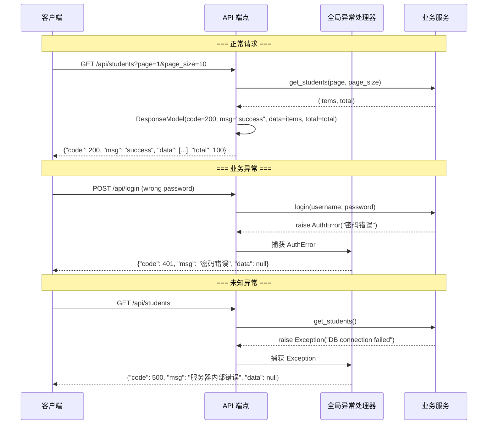

# 统一响应信封

## 为什么需要它

API 返回格式不统一会导致：

1. **前端需要写多套解析逻辑**：成功响应是 `{data: [...]}`，错误响应是 `{error: "..."}` 
2. **分页信息散落各处**：有的接口返回 `total` 在顶层，有的在 `data.total`
3. **错误处理分散**：每个接口自己 try/catch 返回错误，格式不一致
4. **日志和监控困难**：没有统一的结构来提取状态码和消息

统一响应信封解决：**所有 API 响应包裹在相同的 `{code, msg, data, total}` 结构中，前端只需一套解析逻辑。**

适用场景：
- REST API 设计
- 前后端分离项目
- 微服务网关的统一响应格式
- BFF (Backend for Frontend) 层

---

## 本项目中的应用

本项目定义了一个标准的响应模型和全局异常处理器：

```python
# scheme/response_scheme.py
class ResponseModel(BaseModel):
    code: int = 200
    msg: str = "success"
    data: Any = None
    total: int | None = None  # 分页列表的总条数
```

所有 API 端点通过 `ResponseModel` 包裹返回值，FastAPI 的 `exception_handler` 统一处理异常。

---

## 实现流程



---

## 核心实现

### 1. 响应模型定义

```python
# scheme/response_scheme.py
from pydantic import BaseModel
from typing import Any

class ResponseModel(BaseModel):
    code: int = 200       # HTTP 状态码语义：200 成功，4xx 客户端错误，5xx 服务端错误
    msg: str = "success"  # 人类可读的消息
    data: Any = None      # 实际响应数据（列表、对象、null）
    total: int | None = None  # 分页总条数（仅在列表接口出现）
```

### 2. API 端点使用

```python
# API/student_api.py
@router.get("/students")
async def list_students(page: int = 1, page_size: int = 10, ...):
    items, total = student_service.get_students(page, page_size, ...)
    return ResponseModel(data=items, total=total)

@router.post("/students")
async def create_student(data: StudentCreate, ...):
    student = student_service.create_student(data)
    return ResponseModel(msg="创建成功", data=student)

@router.delete("/students/{student_id}")
async def delete_student(student_id: int, ...):
    student_service.delete_student(student_id)
    return ResponseModel(msg="删除成功")
```

### 3. 全局异常处理器

```python
# main.py
@app.exception_handler(AuthError)
async def auth_exception_handler(request, exc: AuthError):
    return JSONResponse(
        status_code=401,
        content={"code": 401, "msg": str(exc), "data": None}
    )

@app.exception_handler(Exception)
async def global_exception_handler(request, exc: Exception):
    logger.exception("未处理的异常")
    return JSONResponse(
        status_code=500,
        content={"code": 500, "msg": "服务器内部错误", "data": None}
    )
```

---

## 最佳实践

### 应该这样设计
- **code 对应 HTTP 状态码语义**：200 成功，4xx 客户端错误，5xx 服务端错误。前端可以根据 code 做统一错误处理
- **msg 面向用户还是开发者要一致**：本项目中 msg 面向用户（"密码错误"而非"AuthError: password mismatch at line 42"）
- **data 可以为 null**：删除、更新等操作成功但无返回数据时，data 为 null 是合理的
- **分页用 total**：列表接口统一用 `total` 字段返回总数，前端据此计算分页

### 不应该这样设计
- 不要把 HTTP 状态码和业务状态码混在一起（如 `code: 10001` 表示"用户名已存在"）。应该用 HTTP 状态码 + msg 描述，保持 code 的 HTTP 语义
- 不要在 data 里嵌套 `{success: true, result: {...}}`（ResponseModel 本身已经表达了成功/失败）
- 不要省略 total（前端无法计算总页数，无法渲染分页器）

### 常见踩坑
- **total 只在列表接口出现**：单个对象查询不需要 total，设为 None 即可
- **data 为 null vs data 为 [] 的区别**：null 表示"没有数据"（如查询单个对象不存在），[] 表示"数据是空列表"（如列表查询无结果）

---

## 面试亮点

**面试官可能追问：**
> "为什么不用 HTTP 状态码直接表示，还要包一层 code？"

回答：两层原因。一是某些反向代理/网关会改写 HTTP 状态码。二是前端统一拦截器可以根据 `response.data.code` 做统一处理（如 401 跳转登录页），而不需要在每个请求的回调里检查。

---

## 可以迁移到哪些项目

- 任何 REST API 项目
- 前后端分离项目
- 微服务网关
- BFF 层

---

## 标签

#API设计 #响应格式 #FastAPI #前后端分离
