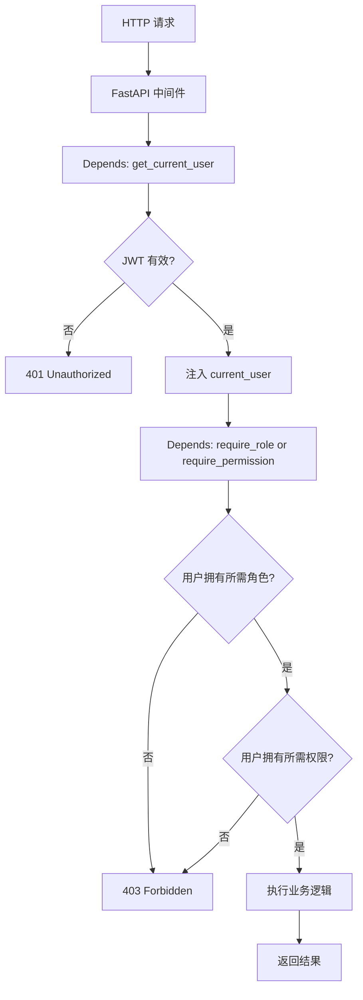

# RBAC 权限设计

## 为什么需要它

后台管理系统随着功能增长，简单的"登录/未登录"二分鉴权不再够用：

1. **不同角色看不同菜单**：学生看自己的成绩，管理员看所有学生
2. **同一个页面不同操作权限**：普通老师可以查成绩但不能导出，管理员可以导出
3. **最小权限原则**：用户只拥有完成工作所需的最小权限集合

RBAC (Role-Based Access Control) 解决：**通过 用户 → 角色 → 权限 的三层映射，实现灵活的权限管理。**

适用场景：
- 后台管理系统
- SaaS 多租户平台
- 企业内部系统（不同部门不同权限）
- 教育系统（学生/教师/管理员）
- 任何需要精细化权限控制的 Web 应用

---

## 本项目中的应用

本项目实现了标准 RBAC，包含两类权限：

| 权限类型 | 含义 | 示例 |
|---------|------|------|
| `menu` | 前端路由/菜单可见性 | `student_management`, `system_management` |
| `action` | 后端 API 操作权限 | `student:delete`, `score:export` |

数据模型：

```
SysUser ──多对多── SysUserRole ──── SysRole ──多对多── SysRolePermission ──── SysPermission
```

设计决策：

| 决策 | 原因 |
|------|------|
| 逻辑删除 (`is_deleted`) | RBAC 数据是审计关键，不能物理删除 |
| 菜单权限和操作权限分离 | 前端用 menu 控制路由守卫，后端用 action 控制 API 守卫 |
| 依赖注入式鉴权 | FastAPI `Depends(get_current_user)` + `Depends(require_permission("xxx"))` |

---

## 实现流程



---

## 核心实现

### 1. 数据模型（5 张表）

```python
# model/Auth.py
class SysUser(Base):
    __tablename__ = "sys_user"
    id, username, password_hash, real_name, email, is_deleted, create_time

class SysRole(Base):
    __tablename__ = "sys_role"  
    id, role_name, role_code, description, is_deleted

class SysPermission(Base):
    __tablename__ = "sys_permission"
    id, permission_name, permission_code, permission_type  # 'menu' or 'action'

# 两个多对多关联表
class SysUserRole(Base):
    user_id, role_id

class SysRolePermission(Base):
    role_id, permission_id
```

### 2. 依赖注入式鉴权

```python
# util/rbac.py
from fastapi import Depends, HTTPException

def get_current_user(
    token: str = Depends(oauth2_scheme),
    db: Session = Depends(get_db)
) -> dict:
    payload = decode_access_token(token)
    user = auth_dao.get_user_by_id(int(payload['sub']), db)
    if not user or user.is_deleted:
        raise HTTPException(status_code=401)
    return {"user_id": user.id, "username": user.username, ...}

def require_role(*roles: str):
    """要求用户拥有指定角色之一"""
    async def dependency(current_user = Depends(get_current_user), db = Depends(get_db)):
        user_roles = auth_dao.get_user_role_codes(current_user['user_id'], db)
        if not any(r in roles for r in user_roles):
            raise HTTPException(status_code=403)
        return current_user
    return dependency

def require_permission(*permissions: str):
    """要求用户拥有指定权限之一"""
    async def dependency(current_user = Depends(get_current_user), db = Depends(get_db)):
        user_perms = auth_dao.get_user_permission_codes(current_user['user_id'], db)
        if not any(p in permissions for p in user_perms):
            raise HTTPException(status_code=403)
        return current_user
    return dependency
```

### 3. API 层使用示例

```python
# API/system_api.py
@router.get("/users")
async def list_users(
    current_user = Depends(require_permission("system:user:list")),
    ...
):
    ...

@router.delete("/users/{user_id}")
async def delete_user(
    current_user = Depends(require_permission("system:user:delete")),
    ...
):
    ...
```

### 4. 前端路由守卫

```javascript
// frontend-vue/src/router/index.js
const routes = [
  {
    path: '/system',
    component: SystemView,
    meta: { menuCode: 'system_management', adminOnly: true },
  },
]

router.beforeEach((to, from, next) => {
  const userPermissions = store.state.userPermissions;
  if (to.meta.menuCode && !userPermissions.includes(to.meta.menuCode)) {
    next('/403');
  }
  next();
});
```

---

## 最佳实践

### 应该这样设计
- **权限码用 `模块:资源:操作` 格式**：`student:score:export` 比 `can_export_score` 更有层次感
- **菜单权限和操作权限分离**：能看到页面 ≠ 能执行所有操作
- **多对多关系**：用户可以有多个角色，角色可以有多个权限
- **逻辑删除**：RBAC 数据是审计关键，`is_deleted` 标记比物理删除安全
- **依赖注入式鉴权**：FastAPI 的 `Depends` 让鉴权逻辑与业务逻辑分离

### 不应该这样设计
- 不要把权限码硬编码在前端（前端路由用 `menuCode`，后端 API 用 `actionCode`）
- 不要把角色名写死在代码里（用 `role_code` 字符串配置，数据库驱动）
- 不要用单一 `role` 字段代替 RBAC（扩展性差，加一个新角色要改代码）

### 常见踩坑
- **权限缓存失效**：如果用户权限在 DB 更新了，但 JWT 中的权限还是旧的。解决方案是权限不在 JWT 中，每次请求实时从 DB 查（或用短 TTL 缓存）
- **N+1 查询**：查用户权限时注意 JOIN，一次性查出所有权限码

---

## 面试亮点

**面试官可能追问：**
> "RBAC 和 ABAC 有什么区别？你们为什么选 RBAC？"

回答：RBAC 通过"角色"间接管理权限，适合角色层次清晰的场景（学生/教师/管理员）。ABAC 通过属性（时间、地点、资源属性）做细粒度控制，适合更复杂的场景。我们当前选 RBAC 是因为角色层次明确，实现和维护成本低。如果未来需要"班主任只能在工作日 8-18 点导出成绩"，则可以在 RBAC 基础上叠加 ABAC 规则。

---

## 可以迁移到哪些项目

- 后台管理系统
- SaaS 平台
- 企业 OA 系统
- 教育管理系统
- CMS 内容管理系统

---

## 标签

#RBAC #权限 #认证 #鉴权 #安全
