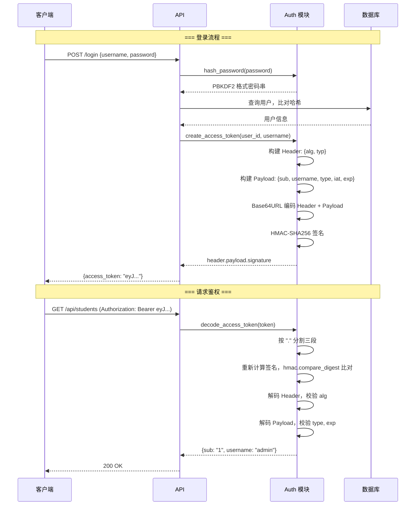

# 纯标准库 JWT 实现

## 为什么需要它

大多数 Python 项目直接用 `PyJWT` 库处理 JWT，但某些场景下会有问题：

1. **依赖冲突**：PyJWT、python-jose、authlib 等库版本冲突（如 PyJWT 1.x vs 2.x API 不兼容）
2. **安全审计**：第三方库的 CVE 漏洞需要等待上游修复
3. **环境限制**：某些离线环境无法安装第三方包
4. **定制需求**：需要特殊的签名算法或 payload 格式，框架不支持

纯标准库 JWT 实现解决：**用 Python 内置的 `hmac` + `hashlib` + `base64` 实现 JWT，零外部依赖。**

适用场景：
- 对供应链安全要求高的项目
- 离线/内网环境
- 微服务间的轻量认证（不需要 OAuth2 完整流程）
- 教学场景（理解 JWT 内部原理）

---

## 本项目中的应用

本项目用约 130 行纯 Python 标准库代码实现了完整的 JWT 认证链路：

| 能力 | 实现 |
|------|------|
| 签名算法 | HMAC-SHA256 (HS256) |
| 密码哈希 | PBKDF2-SHA256，600,000 次迭代，随机 16 字节 salt |
| Token 类型校验 | payload.type == "access" |
| 过期校验 | payload.exp 与当前 UTC 时间比对 |
| 算法校验 | header.alg == "HS256" |
| 签名比对 | 常量时间 `hmac.compare_digest`（防时序攻击） |

---

## 实现流程



---

## 核心实现

### 1. Base64URL 编解码（纯标准库）

```python
# util/auth.py
def _b64url_encode(raw: bytes) -> str:
    """URL 安全的 Base64 编码，去掉末尾的 = 填充"""
    return base64.urlsafe_b64encode(raw).decode().rstrip('=')

def _b64url_decode(text: str) -> bytes:
    """补回 = 填充后解码"""
    padding = '=' * (-len(text) % 4)
    return base64.urlsafe_b64decode(text + padding)
```

### 2. HMAC-SHA256 签名

```python
def _sign(signing_input: bytes) -> str:
    signature = hmac.new(
        AUTH_SECRET_KEY.encode('utf-8'),
        signing_input,
        hashlib.sha256,
    ).digest()
    return _b64url_encode(signature)
```

### 3. Token 生成

```python
def create_access_token(user_id: int, username: str, expires_minutes: int = 720) -> str:
    now = datetime.now(timezone.utc)
    payload = {
        'sub': str(user_id),
        'username': username,
        'type': 'access',
        'iat': int(now.timestamp()),
        'exp': int((now + timedelta(minutes=expires_minutes)).timestamp()),
    }
    header = {'alg': 'HS256', 'typ': 'JWT'}
    header_b64 = _b64url_encode(_json_dumps(header))
    payload_b64 = _b64url_encode(_json_dumps(payload))
    signing_input = f'{header_b64}.{payload_b64}'.encode('utf-8')
    signature_b64 = _sign(signing_input)
    return f'{header_b64}.{payload_b64}.{signature_b64}'
```

### 4. Token 验证（七步检查）

```python
def decode_access_token(token: str) -> dict:
    # 1. 格式检查：必须包含两个点
    header_b64, payload_b64, signature_b64 = token.split('.')
    
    # 2. 签名验证：重新计算并常量时间比对
    signing_input = f'{header_b64}.{payload_b64}'.encode('utf-8')
    expected_signature = _sign(signing_input)
    if not hmac.compare_digest(signature_b64, expected_signature):
        raise AuthError('无效的登录凭证')
    
    # 3. 解码 Header 和 Payload
    header = json.loads(_b64url_decode(header_b64))
    payload = json.loads(_b64url_decode(payload_b64))
    
    # 4. 算法校验
    if header.get('alg') != 'HS256':
        raise AuthError('无效的登录凭证')
    
    # 5. Token 类型校验
    if payload.get('type') != 'access' or 'sub' not in payload:
        raise AuthError('无效的登录凭证')
    
    # 6. 过期时间类型校验
    exp = payload.get('exp')
    if not isinstance(exp, int):
        raise AuthError('无效的登录凭证')
    
    # 7. 过期校验
    if int(datetime.now(timezone.utc).timestamp()) >= exp:
        raise AuthError('登录已过期，请重新登录')
    
    return payload
```

### 5. PBKDF2 密码哈希

```python
def hash_password(password: str, iterations: int = 600_000) -> str:
    validate_password_strength(password)  # 8位以上，含字母+数字
    salt = _b64url_encode(os.urandom(16))
    dk = hashlib.pbkdf2_hmac('sha256', password.encode(), salt.encode(), iterations)
    return f'pbkdf2_sha256${iterations}${salt}${_b64url_encode(dk)}'

def verify_password(password: str, stored_hash: str) -> bool:
    prefix, iterations_str, salt, hash_value = stored_hash.split('$', 3)
    iterations = int(iterations_str)
    new_dk = hashlib.pbkdf2_hmac('sha256', password.encode(), salt.encode(), iterations)
    return hmac.compare_digest(_b64url_encode(new_dk), hash_value)
```

---

## 最佳实践

### 应该这样设计
- **`hmac.compare_digest` 做签名比对**：常量时间比较，防时序攻击
- **token type 字段**：payload 中加 `type: "access"`，防止 refresh token 被当作 access token 使用
- **统一错误消息**：所有校验失败返回相同的 `"无效的登录凭证"`，不泄露具体失败原因
- **密码格式自描述**：`pbkdf2_sha256$600000$salt$hash` 格式包含算法名和迭代次数，未来可无缝升级

### 不应该这样设计
- 不要在 payload 中放敏感信息（JWT 的 payload 只是 Base64 编码，不是加密）
- 不要用 `==` 做签名比对（时序攻击）
- 不要把 token 存在 localStorage（XSS 攻击面）

### 常见踩坑
- **Base64URL 不是 Base64**：URL 安全版本用 `-` 替换 `+`，`_` 替换 `/`，去掉 `=` 填充
- **时间戳必须 int**：`iat` 和 `exp` 用 `int(timestamp)`，不能是 float
- **UTC 时间**：`datetime.now(timezone.utc)`，不能混用时区

---

## 面试亮点

**面试官可能追问：**
> "为什么不用 PyJWT？"

回答：减少依赖即减少攻击面。JWT HS256 的核心逻辑不到 100 行标准库代码，引入一个第三方库反而增加了供应链风险。我们的实现经过安全审查（常量时间比对、类型校验、过期校验），自维护成本可控。

> "如果未来需要支持 RS256 怎么办？"

回答：RS256 需要在 Header 中声明 `alg: "RS256"` 和使用 `cryptography` 库做 RSA 签名。我们的 `_sign` 函数是独立封装的，只需替换签名逻辑即可。但 HS256 对单体应用已经足够——密钥在服务端安全存储，不需要公钥分发。

---

## 可以迁移到哪些项目

- 微服务认证
- API 鉴权
- 单点登录 (SSO)
- 内部工具链
- 任何需要轻量 Token 认证的场景

---

## 标签

#JWT #认证 #安全 #标准库 #PBKDF2
