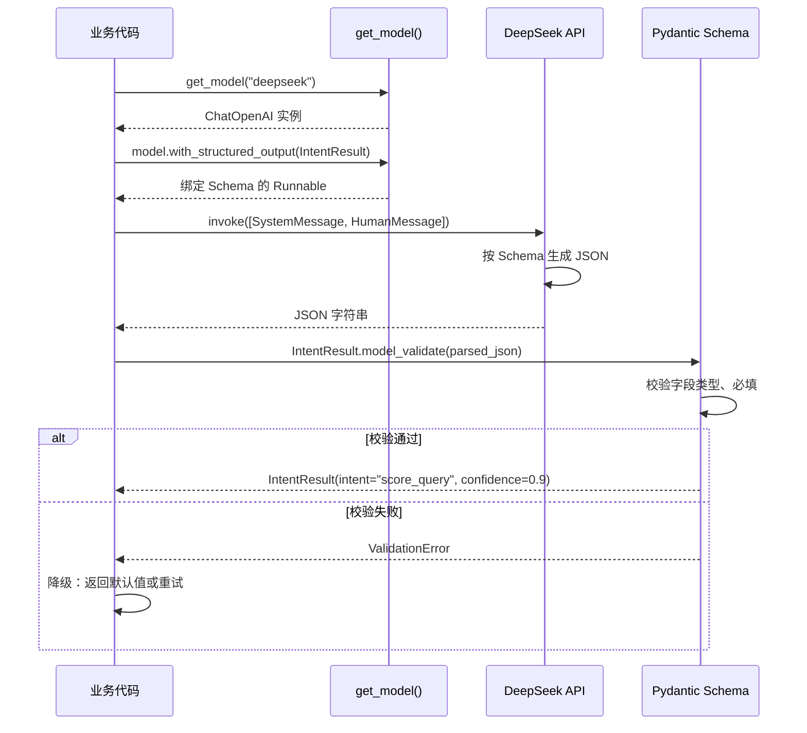

# LLM 结构化输出

## 为什么需要它

LLM 默认输出自然语言文本，但下游系统需要结构化数据：

1. **意图分类**：需要 LLM 输出 `{intent: "score_query", confidence: 0.9}`，而不是"用户想查成绩"
2. **任务规划**：需要输出 `[{step_id: 1, tool_name: "score_tool"}]`，而不是一段描述
3. **数据提取**：需要输出 `{name: "张三", score: 95}`，而不是"张三得了95分"

如果让 LLM 自由输出然后正则解析，会遇到三个问题：

1. **格式不稳定**：LLM 有时输出 JSON，有时输出 Markdown 代码块包裹的 JSON，有时在 JSON 前后加废话
2. **字段缺失**：LLM 可能遗漏某些字段，下游代码访问时 KeyError
3. **类型错误**：LLM 可能把数字输出为字符串 `"95"` 而不是 `95`

LLM 结构化输出解决：**用 Pydantic Schema 约束 LLM 输出格式，自动校验和解析为类型安全的 Python 对象。**

适用场景：
- Agent 意图分类
- 任务规划
- 信息提取
- 任何需要从 LLM 输出中提取结构化数据的场景

---

## 本项目中的应用

本项目使用 `langchain_core` 的 `with_structured_output` 方法，结合 Pydantic 模型，实现类型安全的 LLM 输出。

关键设计：

| 组件 | 作用 |
|------|------|
| Pydantic BaseModel | 定义输出结构（字段名、类型、描述） |
| `get_model().with_structured_output(Schema)` | 绑定 Schema 到 LLM 调用 |
| `model.invoke(messages)` | 返回验证后的 Pydantic 实例 |
| try/except + 降级 | 解析失败时回退到默认值或重试 |

---

## 实现流程



---

## 核心实现

### 1. 模型工厂 + 结构化输出绑定

```python
# llm_basic.py
from langchain_openai import ChatOpenAI
from langchain_core.messages import SystemMessage, HumanMessage

def get_model(provider: str = "deepseek"):
    """统一 LLM 工厂，支持结构化输出绑定"""
    if provider == "deepseek":
        return ChatOpenAI(
            model="deepseek-chat",
            api_key=DEEPSEEK_API_KEY,
            base_url="https://api.deepseek.com/v1",
            temperature=0.1,  # 结构化输出用低温度
        )
    # ... 其他 provider ...

def invoke_with_schema(schema, messages, provider="deepseek"):
    """通用的结构化输出调用 + 降级处理"""
    try:
        model = get_model(provider)
        structured_model = model.with_structured_output(schema)
        return structured_model.invoke(messages)
    except Exception as e:
        logger.warning("结构化输出失败: %s", e)
        return None
```

### 2. 意图分类 Schema 示例

```python
# agent_system/prompts/intent_prompt.py
from pydantic import BaseModel, Field

class IntentResult(BaseModel):
    intent: str = Field(
        description="意图类型",
        enum=[
            "score_query", "student_info", "knowledge_question",
            "data_statistics", "weather_query", "image_generation",
            "email_draft", "commute_plan", "nearby_service",
            "chat_greeting", "emotional_support", "other"
        ]
    )
    confidence: float = Field(description="置信度 0.0-1.0")
    reason: str = Field(description="分类理由，一句话")
```

### 3. 任务规划 Schema 示例

```python
# agent_system/prompts/planner_prompt.py
class PlanStep(BaseModel):
    step_id: int
    tool_name: str
    params: dict = Field(default_factory=dict)
    inputs_from: list[str] = Field(default_factory=list)
    reason: str = ""

class PlanSchema(BaseModel):
    intent: str
    persona: str = "academic_mentor"
    steps: list[PlanStep] = Field(default_factory=list)
    need_llm_summary: bool = False
    summary_instruction: str = ""
    fallback_response: str | None = None
```

### 4. 调用示例

```python
# agent_system/planner/intent_classifier.py
def classify_intent(message: str) -> IntentResult:
    messages = [
        SystemMessage(content=INTENT_CLASSIFIER_PROMPT),
        HumanMessage(content=message),
    ]
    result = invoke_with_schema(IntentResult, messages)
    if result is None:
        return IntentResult(intent="other", confidence=0.0, reason="分类失败")  # 降级
    return result
```

---

## 最佳实践

### 应该这样设计
- **用 Pydantic `Field(description=...)` 描述每个字段**：LLM 通过 description 理解字段含义，description 质量直接影响输出质量
- **用 `enum` 约束分类值**：`intent: str = Field(enum=["score_query", ...])` 比 `intent: str` 更稳定
- **低温度**：结构化输出不需要创造性，`temperature=0.0~0.1` 减少格式变异
- **必填 vs 可选**：核心字段用必填，辅助字段用 `default` 或 `| None`
- **降级永远有默认值**：LLM 输出解析失败时，返回安全的默认值而非抛异常

### 不应该这样设计
- 不要让 LLM 输出 Markdown 包裹的 JSON（如 ` ```json {...} ``` `），LangChain 的 `with_structured_output` 已处理
- 不要用 `eval()` 或手写正则解析 LLM JSON 输出（安全风险 + 脆弱）
- 不要把 Schema 写得太复杂（嵌套超过 3 层会影响准确性）

### 常见踩坑
- **Schema 太大导致输出超长**：一个 PlanSchema 可能包含多个 PlanStep，steps 列表不宜超过 10 个
- **LLM Provider 兼容性**：不是所有 provider 都原生支持 structured output。LangChain 的 `with_structured_output` 对 OpenAI-compatible API 通过 function calling 实现，对不支持的 provider 降级为 JSON mode
- **中文字段描述**：字段 description 用 LLM 的母语写（英语对大多数模型效果更好），但中文模型用中文描述更准确

---

## 面试亮点

**面试官可能追问：**
> "结构化输出和 Function Calling 有什么区别？"

回答：本质相同，都是让 LLM 按预定义 Schema 输出。LangChain 的 `with_structured_output` 底层在支持的 provider 上走 Function Calling，在不支持的 provider 上走 JSON mode + Pydantic 校验。区别是结构化输出的 Schema 由应用定义（Pydantic），Function Calling 的 Schema 是 provider API 的参数格式。

> "如果 LLM 输出的 JSON 字段缺失怎么办？"

回答：LangChain 会尝试重试（retry）。如果重试后仍然缺失，Pydantic 校验阶段会抛出 ValidationError。我们的 `invoke_with_schema` 捕获异常后返回 None，调用方有降级逻辑（如 IntentResult 默认值设为 `other`）。

---

## 可以迁移到哪些项目

- Agent 意图分类
- 信息提取（从文本中提取结构化字段）
- 任务规划（LLM 生成执行计划）
- 表单自动填充
- 文档解析（发票、合同、简历解析）

---

## 标签

#LLM #结构化输出 #Pydantic #LangChain #Schema
