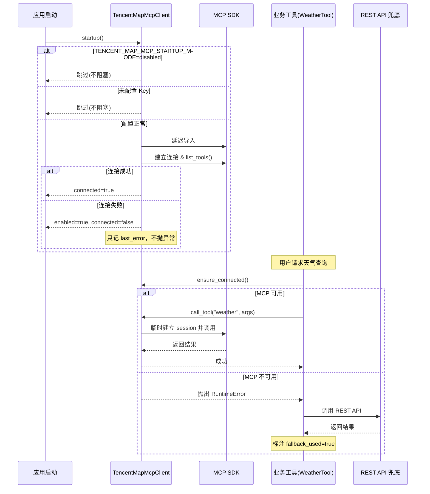

# MCP工具集成与自动降级

## 为什么需要它

当后端服务通过 MCP (Model Context Protocol) 接入外部能力时，面临三个核心风险：

1. **启动耦合**：MCP 远端不可用会导致应用启动失败
2. **单点故障**：MCP 服务中断导致对应功能完全不可用
3. **依赖锁定**：业务工具与 MCP SDK 强绑定，换供应商成本极高

MCP 集成与降级模式解决的就是：**如何在不牺牲可用性的前提下，渐进式引入 MCP 能力。**

适用场景：
- 接入腾讯地图、天气、搜索等第三方 MCP Server
- 从 REST API 迁移到 MCP 协议的过渡期
- 多供应商互为备份的能力架构

---

## 本项目中的应用

本项目通过 `TencentMapMcpClient` 接入腾讯地图 MCP（天气查询、路线规划、周边检索），同时保留了 REST 兜底方案。

核心设计决策：

| 决策 | 原因 |
|------|------|
| 启动时不阻塞 | MCP 探测失败只记日志，不抛异常 |
| 首次调用的懒连接 | 把远端探测从关键路径移到非关键路径 |
| 每次调用重建 session | 避免跨事件循环的 session 复用问题 |
| 业务工具保留兜底 | `WeatherTool` 等工具在 MCP 失败时自动切换 REST |
| SDK 延迟导入 | MCP SDK 未安装时应用照常启动，等实际调用时才报错 |

---

## 实现流程



---

## 核心实现

### 1. 启动探测（非阻塞）

```python
# agent_system/tools/mcp_client.py
async def startup(self) -> None:
    if self.startup_mode == "disabled":
        self._mark_disabled("TENCENT_MAP_MCP_STARTUP_MODE=disabled")
        return
    if not self.api_key:
        self._mark_disabled("未配置 TENCENT_MAP_KEY")
        return
    try:
        ClientSession, streamablehttp_client = self._load_sdk()
        async with streamablehttp_client(self.endpoint) as (read_stream, write_stream, _):
            async with ClientSession(read_stream, write_stream) as session:
                await session.initialize()
                tools_result = await session.list_tools()
        self.tools = self._normalize_tools(tools_result)
        self.connected = True
        self.enabled = True
        self.last_error = None
    except Exception as exc:
        self.enabled = bool(self.api_key)
        self.connected = False
        self.last_error = str(exc)
        logger.warning("腾讯地图 MCP 初始化失败，将使用 REST 兜底: %s", exc)
```

### 2. 每次调用临时建连（避免跨事件循环问题）

```python
async def call_tool(self, tool_name: str, arguments: dict) -> dict:
    if not self.connected:
        await self.ensure_connected()
    if not self.connected:
        raise RuntimeError(self.last_error or "腾讯地图 MCP 未连接")
    # 每次调用临时建立会话
    async with streamablehttp_client(self.endpoint) as (read_stream, write_stream, _):
        async with ClientSession(read_stream, write_stream) as session:
            await session.initialize()
            result = await session.call_tool(tool_name, arguments)
    return self._normalize_call_result(result)
```

### 3. 业务工具侧的兜底逻辑

业务工具（如 `WeatherTool`）不直接依赖 MCP，而是：
1. 先尝试 `mcp_client.call_tool()`
2. 捕获 `RuntimeError` 后切换 `_fallback_rest()`
3. 在返回结果中标注 `fallback_used: true`

### 4. 健康监控接口

```python
def health(self) -> dict:
    return {
        "enabled": self.enabled,
        "connected": self.connected,
        "startup_mode": self.startup_mode,
        "tool_count": len(self.tools),
        "last_error": self.last_error,
        "last_success_at": self.last_success_at,
    }
```

---

## 最佳实践

### 应该这样设计
- **启动探测与首次调用分离**：`startup()` 只做非关键路径探测，`ensure_connected()` 在首次调用时按需连接
- **配置开关控制**：通过 `TENCENT_MAP_MCP_STARTUP_MODE` 环境变量控制启用/禁用，运维可随时切换
- **业务工具永远保留兜底**：MCP 只是"更好的实现"，不是"唯一的实现"
- **结果格式规范化**：`_normalize_call_result()` 统一 MCP 返回格式，业务工具不感知 MCP 内部结构

### 不应该这样设计
- 不要在 `__init__` 或模块导入时同步连接 MCP —— 会让应用启动耦合远端可用性
- 不要复用启动阶段的 MCP session —— 跨事件循环会导致 connection closed 错误
- 不要在业务工具中直接依赖 MCP SDK 类型 —— 降低替换成本

### 推荐方案
- MCP Client 作为**全局单例**，所有业务工具共享同一个实例
- 工具发现用 `find_tool_name(keywords)` 做模糊匹配，降低 API 变更的影响
- 同步/异步双入口：`call_tool`（异步） + `call_tool_sync`（同步适配器，检测事件循环后决定用 `asyncio.run` 还是直接抛异常）

### 常见踩坑
- **跨事件循环**：用 `asyncio.get_running_loop()` 检测，如果在已有事件循环中调用同步方法则抛错
- **SDK 未安装**：`_load_sdk()` 延迟导入并捕获异常，不在模块顶层 `import mcp`

---

## 面试亮点

**面试官可能追问：**
> "MCP 服务挂了，你们的应用会怎样？"

回答：不会挂。启动时 MCP 探测失败只记日志，业务工具自动降级到 REST API。运维可以通过健康检查接口看到 MCP 状态，但用户不受影响。

> "为什么不直接用 REST，还要走 MCP？"

回答：MCP 的优势是工具发现（`list_tools`）和标准化调用协议，新增能力不需要改代码。但为了可靠性，我们保留了 REST 兜底，MCP 是"更好的实现"而非"唯一的实现"。

---

## 可以迁移到哪些项目

- Agent 平台（接入多种 MCP Server）
- AI 客服系统（天气、地图、物流查询等外部能力）
- 工作流平台（MCP 作为插件协议）
- 企业知识库（MCP 接入多个数据源）
- 任何渐进式引入 MCP 的遗留系统

---

## 标签

#MCP #降级 #高可用 #Agent #工具集成
