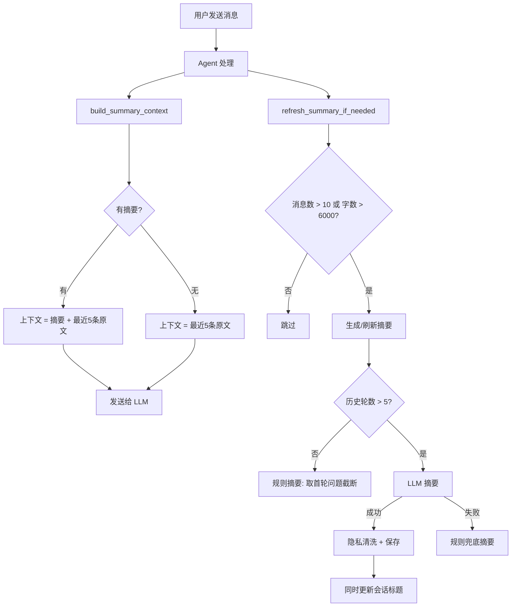

# Agent 记忆系统

## 为什么需要它

LLM 的上下文窗口有限，而对话会越来越长。当对话超过几十轮后，直接面临三个问题：

1. **Token 爆炸**：每轮都带全部历史，成本线性增长直到超出窗口
2. **信息稀释**：早期关键信息被淹没在大量闲聊中
3. **跨轮连贯性**：用户说"上次那个成绩"时，Agent 需要知道"上次"指什么

Agent 记忆系统解决：**用摘要压缩 + 最近原文的组合，在有限 Token 预算内保留最重要的上下文。**

适用场景：
- 多轮对话 Agent
- AI 客服（需要记住用户上下文）
- AI 助教（需要记住学生的学习进展）
- 任何需要维护对话状态的 LLM 应用

---

## 本项目中的应用

本项目实现了双层记忆架构：

| 层级 | 存储内容 | 作用 | 触发条件 |
|------|---------|------|---------|
| **工作记忆** | 最近 5 条原文 | 当前对话的准确上下文 | 每次请求 |
| **摘要记忆** | LLM 生成的会话标题 | 长对话的压缩表示 | >10 条消息 或 >6000 字符时触发刷新 |

设计决策：

- **不做跨会话长期记忆**：每个 session 独立，不跨会话推断用户画像（隐私优先）
- **摘要刷新失败不阻塞**：`refresh_summary_if_needed` 失败只记日志，不影响 Agent 回复
- **LLM 摘要 + 规则兜底**：LLM 不可用时降级为基于首轮问题的规则摘要

---

## 实现流程



---

## 核心实现

### 1. 摘要触发的双阈值

```python
# agent_system/memory/summary_memory.py
SUMMARY_MESSAGE_THRESHOLD = 10   # 超过 10 条消息触发
SUMMARY_CHAR_THRESHOLD = 6000    # 或历史文本超过 6000 字触发

def should_refresh_summary(session_id: int, db: Session) -> bool:
    messages = talk_dao.get_messages_by_session(session_id, db)
    if len(messages) > SUMMARY_MESSAGE_THRESHOLD:
        return True
    history = [message_to_history_item(msg) for msg in messages if msg]
    return estimate_history_chars(history) > SUMMARY_CHAR_THRESHOLD
```

### 2. 摘要 Prompt（隐私优先）

```python
_SUMMARY_PROMPT = """你是学生管理系统 Agent 的会话摘要器。
规则：
1. 只保留用户最核心的目标或主题，不写完整过程复盘。
2. 不跨用户、不跨会话推断长期画像。
3. 对陪伴班主任或情绪支持类对话，只记录主题，不记录具体敏感细节。
4. 不记录身份证、手机号、邮箱、详细住址、隐私病史等敏感内容。
5. 24 字以内，直接输出标题文本，不要句号。"""
```

### 3. LLM 摘要 + 规则兜底

```python
def _summarize_history(history, current_summary, persona) -> str:
    user_turns = [item for item in history if item["role"] == "user"]
    if len(user_turns) <= 5:
        return _short_title_from_first_turn(user_turns)  # 短对话用规则
    
    try:
        model = get_model(SUMMARY_PROVIDER)
        response = model.invoke([SystemMessage(content=_SUMMARY_PROMPT), HumanMessage(content=user_message)])
        if response.content.strip():
            return response.content.strip()
    except Exception:
        pass  # LLM 失败静默降级
    return _fallback_summary(history)
```

### 4. 最终上下文组装

```python
def build_summary_context(session_id, db) -> list[dict]:
    """返回"会话摘要 + 最近 5 条原文"的紧凑上下文"""
    session = talk_dao.get_session_by_id(session_id, db)
    messages = talk_dao.get_messages_by_session(session_id, db)
    recent = build_recent_history(messages, max_messages=5)  # 最近 5 条
    return build_context_history(
        summary=session.summary if session else None,
        recent_history=recent
    )
```

### 5. 隐私清洗

```python
def _sanitize_summary(summary: str) -> str:
    text = " ".join(summary.replace("\n", " ").split())
    # 去掉"用户询问/本轮对话"等套话
    text = re.sub(r"^(用户|同学)?(想要|希望|询问|咨询|...)...", "", text)
    # 截断过长的摘要
    if len(text) > 36:
        text = text[:33] + "..."
    return text
```

---

## 最佳实践

### 应该这样设计
- **摘要 + 原文的组合**：长对话用摘要覆盖早期，最近几条保留原文——兼顾准确性和上下文长度
- **失败静默降级**：LLM 摘要失败时用规则摘兜底，不影响主流程
- **隐私优先**：Prompt 中明确要求不记录敏感信息，且有正则清洗兜底
- **阈值触发而非每轮触发**：只在消息数或字数达到阈值时才刷新摘要，节省 LLM 调用

### 不应该这样设计
- 不要每轮都调用 LLM 做摘要（成本高、延迟大）
- 不要让 LLM 跨会话推断用户画像（隐私风险 + 不准确）
- 不要把摘要当成"长期记忆"（摘要是压缩，会丢失细节）

### 常见踩坑
- **短对话不要摘要**：5 轮以内直接用首轮问题做标题，更准确
- **摘要 Prompt 要约束长度**：本项目要求 24 字以内，否则摘要本身也占 token
- **摘要保存失败不要抛异常**：摘要只是锦上添花，不影响核心对话功能

### 演进路径
- **当前**：会话级摘要，不做跨会话
- **下一步**：用户级长期画像（学习风格、关注领域等），需要用户授权
- **远期**：语义记忆 + 情景记忆 + 程序记忆的完整记忆系统

---

## 面试亮点

**面试官可能追问：**
> "为什么不直接用向量数据库做长期记忆？"

回答：当前阶段会话级摘要已经满足需求。向量检索适合"找回相关历史片段"，但教育场景中，学生的连续对话通常是一个连贯主题，摘要比向量搜索更高效。未来如果需要跨会话记忆（比如记住一个学生一个学期以来的学习风格变化），会加入向量检索。

> "摘要会不会丢失重要信息？"

回答：会有损失，但这是有意的设计取舍。摘要是为了在有限 Token 预算内给 Agent 一个"快速了解上下文"的能力。最近 5 条原文保留完整信息，早期对话通过摘要压缩。如果用户回溯更早的话题，摘要中的关键词能帮 Agent 理解上下文。

---

## 可以迁移到哪些项目

- 聊天机器人（多轮对话上下文管理）
- AI 客服（记住客户问题上下文）
- AI 助教（跟踪学生学习进展）
- 企业知识库（会话上下文关联）
- Agent 平台（通用记忆能力）

---

## 标签

#Agent #Memory #摘要 #上下文管理 #隐私
