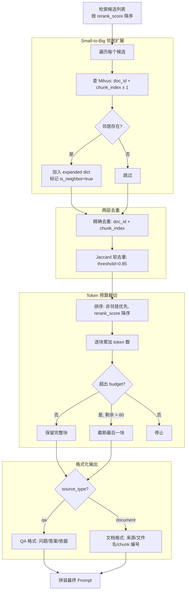

# RAG 上下文组装

## 为什么需要它

混合检索返回的候选片段，不能直接塞给 LLM。存在三个问题：

1. **片段太短，缺少上下文**：一个 chunk 可能只是段落的中间部分，前后文缺失导致 LLM 无法理解
2. **冗余内容**：同一个文档的相邻 chunks 内容高度重叠，直接全送浪费 Token
3. **Token 预算有限**：LLM 上下文窗口有限，需要在有限预算内选最有价值的片段

上下文组装解决：**对检索结果做"扩展→去重→预算裁切→格式化"的四步处理，在有限 Token 内给 LLM 最完整的上下文。**

适用场景：
- 任何 RAG 系统的后处理环节
- 长文档问答（需要跨 chunk 上下文）
- 多文档检索（需要去重合并）

---

## 本项目中的应用

本项目的上下文组装管道：

```
检索候选 → Small-to-Big 邻居扩展 → 精确去重 + Jaccard 软去重 → Token 预算裁切 → 格式化输出
```

| 步骤 | 作用 | 关键参数 |
|------|------|---------|
| **邻居扩展** | 对每个命中 chunk 拉取前后相邻片段 | 前 1 后 1 |
| **精确去重** | 按 (doc_id, chunk_index) 去重 | — |
| **Jaccard 软去重** | 文本内容相似度 > 85% 视为重复 | threshold=0.85 |
| **预算裁切** | 按 Token 预算截断，邻居低优先级 | max_tokens 可配 |
| **格式化** | 按 source_type 用不同模板输出 | — |

---

## 实现流程



---

## 核心实现

### 1. Small-to-Big 邻居扩展

```python
# RAG/prompt_builder.py
def fetch_neighbors(candidates: list[dict]) -> list[dict]:
    """对命中的每个 chunk 拉取前后相邻片段"""
    for candidate in candidates:
        doc_id = candidate.get("doc_id")
        chunk_index = candidate.get("chunk_index")
        
        neighbor_indices = {chunk_index}
        if chunk_index > 0:
            neighbor_indices.add(chunk_index - 1)
        neighbor_indices.add(chunk_index + 1)

        for neighbor_index in sorted(neighbor_indices):
            cache_key = f"{doc_id}_{neighbor_index}"
            if cache_key in expanded:
                continue  # 去重：多个候选共享同一个邻居
            
            if neighbor_index == chunk_index:
                expanded[cache_key] = candidate  # 原 chunk 保留 rerank_score
            else:
                results = collection.query(
                    expr=f'doc_id == "{doc_id}" and chunk_index == {neighbor_index}',
                    output_fields=["doc_id", "text", "file_name", ...],
                    limit=1,
                )
                if results:
                    expanded[cache_key] = {**results[0], "is_neighbor": True}
```

### 2. 两层去重

```python
def deduplicate(candidates, threshold=0.85):
    # 第一层：精确去重（按文档 + 位置）
    seen_keys = set()
    for candidate in sorted(candidates, key=lambda x: x.get("rerank_score"), reverse=True):
        key = (candidate["doc_id"], candidate["chunk_index"])
        if key in seen_keys:
            continue
        seen_keys.add(key)
        first_layer.append(candidate)

    # 第二层：Jaccard 软去重（按文本字符集相似度）
    deduped = []
    seen_texts = []
    for candidate in first_layer:
        text_chars = set(candidate["text"])
        is_dup = False
        for seen_chars in seen_texts:
            union = len(text_chars | seen_chars)
            if union > 0 and len(text_chars & seen_chars) / union > threshold:
                is_dup = True
                break
        if not is_dup:
            deduped.append(candidate)
            seen_texts.append(candidate["text"])
    return deduped
```

### 3. Token 预算裁切

```python
def build_context_blocks(candidates, max_tokens):
    """按 Token 预算裁切：非邻居优先，高分优先"""
    budget = max_tokens or config.max_context_tokens
    blocks = []
    token_count = 0

    # 排序策略：is_neighbor=False 优先（原始命中），rerank_score 降序
    sorted_candidates = sorted(candidates, key=lambda item: (
        item.get("is_neighbor", False),
        -(item.get("rerank_score", item.get("score", 0))),
    ))

    for candidate in sorted_candidates:
        chunk_tokens = estimate_tokens(candidate["text"])
        if token_count + chunk_tokens > budget:
            remaining = budget - token_count
            if remaining > 80:  # 剩余空间够大才截断，否则直接停止
                truncated = {**candidate, "text": candidate["text"][:remaining * 2] + "..."}
                blocks.append(truncated)
            break
        blocks.append(candidate)
        token_count += chunk_tokens
    return blocks, token_count
```

### 4. 格式化（区分 source_type）

```python
def format_context(block, index):
    if block.get("source_type") == "qa":
        return (
            f"[来源 {index} | QA问答对 | {block['file_name']} | #{chunk_index}]\n"
            f"问题: {block['question']}\n答案: {block['answer']}\n依据: {block['reason']}"
        )
    # 默认文档格式
    return (
        f"[来源 {index} | 文档原文 | {block['file_name']} | chunk {chunk_index}]\n"
        f"{block['text']}"
    )
```

---

## 最佳实践

### 应该这样设计
- **邻居扩展在前，去重在后**：扩展可能产生重叠，去重负责清理
- **邻居标记为低优先级**：Token 预算紧张时优先砍邻居，保留原始命中
- **Jaccard 用字符集而非词集**：中文分词不准确，字符集 Jaccard 更鲁棒
- **排序去重**：按 score 降序排列后去重，确保保留高分版本
- **Token 估算用字符数**：中文场景 1 字符 ≈ 1-1.5 token，保守估算用 1:1

### 不应该这样设计
- 不要把邻居扩展的分数设得和原 chunk 一样高（会干扰去重和排序）
- 不要把截断阈值设得太低（< 80 token 的截断基本无意义）
- 不要用 embedding 做去重（太重，Jaccard 对文本块级别的去重已足够）

### 常见踩坑
- **邻居查询失败静默跳过**：邻居不存在是正常情况（文档开头/结尾），不要当错误处理
- **格式化要区分 source_type**：QA 对和文档原文的格式不同，QA 需要展示问题+答案+依据
- **Citation 编号要与格式化中的来源编号一致**：让 LLM 回复中的 `[来源 1]` 能对应上

---

## 面试亮点

**面试官可能追问：**
> "Small-to-Big 扩展会不会引入噪音？"

回答：会的，但利大于弊。邻居 chunk 作为上下文补充，在 Token 裁切时优先级低于原始命中，预算紧张时优先裁剪。而且 CrossEncoder 重排已经在前置环节滤掉了大量不相关候选，到达扩展环节的候选本身相关性就很高。

> "Jaccard 去重 threshold 为什么选 0.85？"

回答：0.85 是基于中文文本块实验的经验值。太低（0.7）会误杀不同但相关的内容（如"成绩分析方法"和"成绩录入流程"），太高（0.95）则基本不去重。0.85 能有效去除几乎相同的相邻 chunk 重复。

---

## 可以迁移到哪些项目

- 企业知识库（长文档分段检索 + 上下文补全）
- 法律文书检索（条款前后文完整性要求高）
- 技术文档 Q&A（代码片段的上下文补全）
- 任何基于 Milvus 的 RAG 系统

---

## 标签

#RAG #上下文组装 #Small-to-Big #去重 #Token预算
