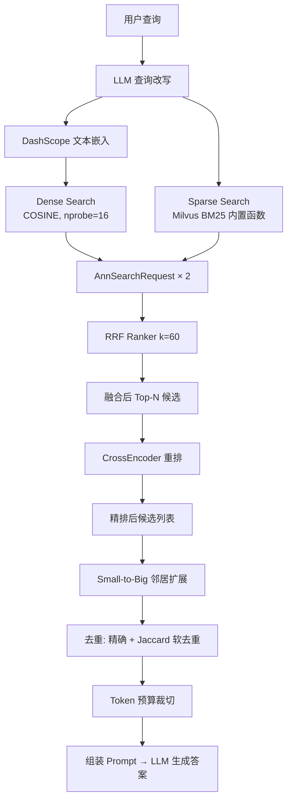

# RAG 混合检索

## 为什么需要它

单一检索方式存在明显短板：

1. **纯稠密向量（语义搜索）**：擅长找"意思相近"的内容，但对专有名词、精确数字不敏感。"第几次考试"可能匹配到完全不相关的"考试须知"
2. **纯 BM25（关键词搜索）**：擅长精确匹配，但无法理解"成绩不错"和"考试结果良好"是同一个意思
3. **两种方式查出的结果差异很大**：需要一种公平的融合策略

混合检索 + RRF 融合解决：**同时跑两种检索，用 RRF (Reciprocal Rank Fusion) 公平合并结果，再送入 CrossEncoder 精排。**

适用场景：
- 企业知识库问答
- 文档检索系统
- 客服知识库
- 教育资料搜索
- 任何需要同时兼顾"语义相似"和"关键词匹配"的检索场景

---

## 本项目中的应用

本项目 RAG 子系统实现了完整的混合检索管道：

```
Query → 查询改写(LLM) → Embedding(DashScope) 
  → Dense Search(COSINE, nprobe=16) + Sparse Search(BM25, Milvus内置)
    → RRF 融合(k=60) → CrossEncoder 重排
```

设计决策：

| 决策 | 原因 |
|------|------|
| BM25 用 Milvus 内置 `FunctionType.BM25` | 写入时自动生成稀疏向量，查询时无需额外服务 |
| RRF 融合而非线性加权 | 不同检索方式的分数量纲不同（COSINE 是 0-1，BM25 无上限），RRF 只用排名信息，天然公平 |
| CrossEncoder 重排在融合之后 | 重排模型更准确但更慢，只在候选集缩小后做精排 |
| Milvus 的 `SPARSE_INVERTED_INDEX` | BM25 特有的索引类型，Milvus 2.4+ 原生支持 |

---

## 实现流程



---

## 核心实现

### 1. 混合检索核心

```python
# RAG/retrieval.py
def hybrid_search(query_text, query_vector, top_k, filter_expr):
    # 稠密向量检索
    req_dense = AnnSearchRequest(
        data=[query_vector],
        anns_field="dense_vector",
        param={"metric_type": "COSINE", "nprobe": 16},
        limit=top_k,
    )
    # BM25 稀疏检索（Milvus 内置函数自动计算）
    req_sparse = AnnSearchRequest(
        data=[query_text],       # 传入原始文本，Milvus 内部调用 BM25 函数
        anns_field="sparse_vector",
        param={"metric_type": "BM25"},
        limit=top_k,
    )
    # RRF 融合：k 值越大，排名靠后的文档权重越大
    ranker = RRFRanker(k=config.rrf_k)

    results = client.hybrid_search(
        collection_name=config.milvus_collection_name,
        reqs=[req_dense, req_sparse],
        ranker=ranker,
        limit=config.rrf_final_n,
        filter=filter_expr,
        output_fields=["doc_id", "text", "file_name", "source_type", ...],
    )
    # 统一格式化为候选 dict 列表
    return _normalize_results(results)
```

### 2. RRF 融合原理

```
RRF_score(doc) = Σ(1 / (k + rank_i(doc)))

其中:
- rank_i(doc) 是 doc 在第 i 个检索器中的排名（从 0 开始）
- k 是平滑参数（默认 60）
- 对所有检索器求和
```

k=60 的直觉：排名第 1 的贡献 1/61，排名第 100 的贡献 1/160。k 值越大，低排名文档的差异越小，结果越"民主"。

### 3. CrossEncoder 重排

```python
# RAG/rerank.py
from sentence_transformers import CrossEncoder

def rerank(query: str, candidates: list[dict]) -> list[dict]:
    pairs = [[query, candidate["text"]] for candidate in candidates]
    scores = model.predict(pairs)  # 使用 CrossEncoder 做深度相关性判断
    for candidate, score in zip(candidates, scores):
        candidate["rerank_score"] = float(score)
    candidates.sort(key=lambda x: x["rerank_score"], reverse=True)
    return candidates
```

### 4. Milvus Collection Schema 关键设计

```python
# RAG/schemas.py
# 关键：在 text 字段上定义 BM25 函数，Milvus 写入时自动生成稀疏向量
bm25_function = Function(
    name="bm25_func",
    function_type=FunctionType.BM25,
    input_field_names=["text"],
    output_field_names="sparse_vector",
)
schema.add_field(FieldSchema(name="sparse_vector", dtype=DataType.SPARSE_FLOAT_VECTOR))
schema.add_function(bm25_function)
```

---

## 最佳实践

### 应该这样设计
- **RRF 而非线性加权**：不同检索方式的分数量纲不同，RRF 只用排名，天然公平
- **Milvus 内置 BM25**：不需要单独的 ES 或外部 BM25 服务，减少运维复杂度
- **CrossEncoder 精排放在重排环节而非检索环节**：CrossEncoder 虽然准，但每次都要推理，只在候选集缩小后使用
- **查询改写用 LLM**：把口语化问题（"上次那个考得怎么样"）压缩为检索友好的表达（"最近一次考试成绩"）

### 不应该这样设计
- 不要把 RAG 和 chat 混在一起（检索是检索，回答是回答，管道独立可测试）
- 不要让过滤条件影响 RRF 排名（filter_expr 应该在 Milvus 层面执行，不影响 RRF 计算）
- 不要对 BM25 结果做归一化再融合（RRF 的设计目的就是避免归一化）

### 性能建议
- **nprobe=16**：平衡准确性和速度，nprobe 越大搜索越准但越慢
- **重排后取 top_k 送 LLM**：CrossEncoder 重排后只保留真正相关的块，节省 LLM Token
- **BM25 向量由 Milvus 自动维护**：写数据时无需手动生成稀疏向量

---

## 面试亮点

**面试官可能追问：**
> "为什么不直接用 Milvus 的 dense search，加 BM25 有什么收益？"

回答：稠密向量在精确数字、专有名词、代码片段等场景表现弱。比如"第三次考试"在稠密向量中会匹配到各种"考试"相关内容，但 BM25 能精确匹配"第三次"这个数量词。两者互补，RRF 融合后的准确率通常比单一检索高 15-25%。

> "RRF 的 k 值怎么选？"

回答：k=60 是学术界推荐的默认值。k 值越大，排名的边际效应递减越慢（更"民主"）；k 值越小，头部排名的影响越大（更"精英"）。实践中 k=60 在大多数场景都 work，如果两个检索器质量差异大，可以降低 k 让优质检索器的主导权更大。

---

## 可以迁移到哪些项目

- 企业知识库（规章制度、SOP 检索）
- 法律文书检索
- 医疗文献搜索
- 电商搜索（商品描述语义匹配 + 属性关键词匹配）
- 代码搜索（语义匹配 + 精确符号匹配）
- 任何需要混合检索的 RAG 系统

---

## 标签

#RAG #混合检索 #Milvus #BM25 #RRF #CrossEncoder
